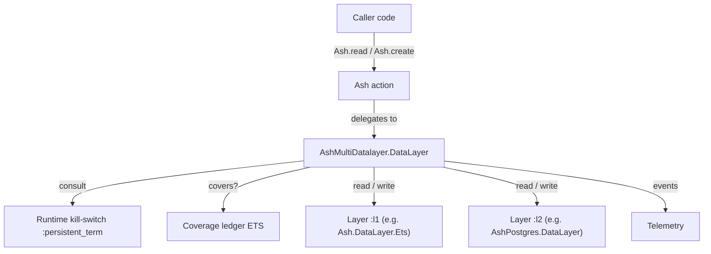

# `ash_multi_datalayer` PRD

**Status**: Accepted (scope B after multi-perspective RFC review) **Created**:
2026-04-17 **Author**: Barnabas Jovanovics **Last Updated**: 2026-07-03

## Problem Hypothesis

We believe **Ash application authors who want to layer an in-process cache over
Postgres** struggle because **today they hand-roll caching inside actions
(memoising in `before_action`/`after_action` hooks), which couples cache logic
to every action and provides no correctness guarantees for filtered list
reads**. If we **expose layered datalayers as a generic composable
`Ash.DataLayer` configured declaratively in the resource DSL**, we expect
**resources to opt into correct read-through behaviour by adding one DSL block,
with no per-action plumbing** — and the same library generalises to other
layered-storage patterns (tiering, migration mirroring) without a rewrite.

## System Context



## Goals and Success Metrics

### Primary Goals

1. **Read fall-through with coverage.** A resource that declares
   `read_order [:l1, :l2]` serves reads from `:l1` whenever the coverage ledger
   proves `:l1` already holds a superset of the incoming query, and falls
   through to `:l2` otherwise.
   - **Metric**: For a benchmark of 10 distinct filters each issued 100 times
     against a seeded Postgres table, the later 99 repeat queries hit `:l1` ≥ 99
     % of the time (1 % miss budget covers cold starts), measured by
     layer-invocation counters.

2. **Filter subsumption across related queries.** When `:l1` has materialised a
   broader filter, narrower filters logically implied by it are served from
   `:l1` without touching `:l2`.
   - **Metric**: A hand-curated set of 20 `(broader, narrower)` filter pairs
     covering `eq`, `not_eq`, `in`, range comparisons, conjunctions,
     disjunctions, and `is_nil` — all answered "covered" by the
     per-attribute-interval implementation; second read in each pair does not
     touch `:l2`.

3. **Row-aware invalidation preserves cache value under writes.** A write to one
   row does not clear unrelated ledger entries.
   - **Metric**: For a 1 000 read / 100 write benchmark across 20 distinct
     filters, at most 10 % of ledger entries are dropped per write on average
     (measured via `:ledger_invalidated` telemetry counts). Conservative "drop
     everything" would drop 100 %.

### Secondary Goals

4. **Solver bugs never cause stale reads.** Any reasoning failure in
   `implies?/2` must produce a cache miss, never a wrong row.
   - **Metric**: Property-based suite cross-checks `implies?/2` against a
     brute-force evaluator over generated finite value domains. No
     counterexamples after 10 k cases.

5. **Honest capability reporting.** `can?/2` reflects the intersection of layers
   named in the relevant `read_order`/`write_order`, so a single-layer write
   config can still advertise `:transact == true`.
   - **Metric**: Unit tests cover every `(read_order, write_order, feature)`
     combination for the shipped two-layer integration scenarios.

6. **Operator safety.** v1 ships with the operational tooling needed to run the
   library in production from day one: ledger cap, divergence sampler, runtime
   kill-switch, rich telemetry, and debug helpers.
   - **Metric**: Each feature has an integration test; each is referenced in the
     runbook.

## Non-Goals

- **Background / asynchronous writes (`:write_behind`, Oban integration).** Cut
  after RFC review. Callers who want asynchronous primary writes wire Oban in
  their actions themselves.
- **Multi-node cache coherence.** v1 is single-node-only; a compile-time check
  forces explicit acknowledgement. Cross-node coherence is a v2 design problem.
- **`field_policies` + fall-through reads.** The subsumption solver cannot prove
  field-level policy compatibility across actors. A verifier rejects the
  combination at compile time.
- **More than two layers in integration tests.** Internal APIs generalise to N
  layers; v1 CI exercises N=2 only.
- **Cache stampede prevention.** Concurrent cold-read coalescing is a follow-up.
- **TTL beyond LRU.** Ledger size cap + LRU eviction ship; time-based TTL does
  not.
- **Per-action strategy override.** Strategy is resource-level in v1.
- **Aggregates / calculations the solver can't fulfil.** Fall-through; not
  re-computed over a cache subset.

## User Stories

### US1: Add layered caching to an existing resource without rewriting actions

> When **I have a read-mostly resource backed by Postgres and I see the same
> query issued thousands of times per minute**, I want to **add an in-process
> cache layer with one DSL block change**, so I can **drop primary load without
> auditing every action that reads the resource**.

**Acceptance Criteria** (MoSCoW-tagged):

- **Must**: Switching `data_layer:` from `AshPostgres.DataLayer` to
  `AshMultiDatalayer.DataLayer` and adding a `multi_data_layer do ... end` block
  (with `layer :l1, Ash.DataLayer.Ets`, `layer :l2, AshPostgres.DataLayer`,
  `read_order [:l1, :l2]`, `write_order [:l2, :l1]`) plus the existing
  `postgres do ... end` block compiles and exhibits fall-through behaviour with
  no other code changes. (*As implemented*, one more line is needed:
  `extensions: [AshPostgres.DataLayer]` on `use Ash.Resource`, because
  underlying DSL sections cannot be auto-installed — see FR1.2.)
- **Must**: Existing reads return the same rows as before the switch.
- **Must**: Migration generation produces equivalent migrations on the
  multi-datalayer resource as on the direct-`AshPostgres.DataLayer` resource.
  *As implemented*: via `mix ash_multi_datalayer.generate_migrations`,
  integration-proven byte-identical (the stock task skips multi-datalayer
  resources; see FR1.4).
- **Should**: Setting `read_order [:l2]` is a drop-to-primary kill- switch
  without removing the DSL block.
- **Should**: `AshMultiDatalayer.disable!(resource)` bypasses the cache layer at
  runtime without recompile.

### US2: Trust the cache under write load

> When **the resource has meaningful write traffic alongside its read traffic**,
> I want to **cache entries to survive unrelated writes**, so I can **keep a
> useful hit rate even on active tables**.

**Acceptance Criteria**:

- **Must**: A write to row R drops only ledger entries whose filter matches R
  (before or after); unrelated filter coverage is preserved.
- **Must**: Row-aware invalidation has its own property test cross- checking
  against `Ash.Filter.Runtime.do_match/2`.
- **Should**: Benchmark shows < 10 % ledger loss per write on a realistic
  workload (see metric under Goal 3).

### US3: Know when the cache is wrong

> When **I depend on the cache for correctness-sensitive reads**, I want to
> **detect cache-vs-primary divergence in production**, so I can **catch solver
> or invalidation bugs before they become support tickets**.

**Acceptance Criteria**:

- **Must**: A configurable share of reads that hit the ledger are shadow-re-run
  against the later layer; mismatches fire telemetry with the filter fingerprint
  and PK delta.
- **Must**: Sampler is configurable per resource; default **0.0** (off,
  opt-in) — changed 2026-07-03 from "default enabled at 1 %"; sampling is a
  probabilistic canary, not a guarantee, and users shouldn't be opted into
  extra lower-layer requests.
- **Should**: Runbook documents the response to a divergence event.

### US4: Extend to non-caching layered storage later

> When **I need a layered datalayer for a non-caching use case** (cold- tier
> storage, migration mirror, polyglot persistence), I want to **reuse the same
> library by configuring `read_order` and `write_order` differently**, so I
> **don't learn a new DSL for each pattern**.

**Acceptance Criteria**:

- **Should**: The DSL uses generic `layer :name, module` with no caching
  semantics baked into layer names.
- **Could**: Documentation shows at least two non-caching configurations as
  recipes (cold-storage tier, migration mirror).

## Requirements

### Functional Requirements

#### FR1: DSL surface `[Must]`

- **FR1.1**: A `multi_data_layer do ... end` section with `layer :name, module`,
  `read_order :: [atom]`, `write_order :: [atom]`,
  `ledger_max_entries :: pos_integer`, `divergence_sampler :: float` (0.0–1.0,
  default 0.0). (A `backfill? :: boolean` option was originally specced;
  removed 2026-07-03 — see the decision log.)
- **FR1.2**: Each declared underlying layer's DSL section is usable on the
  resource. *As implemented*: automatic extension install is infeasible (Spark
  resolves extensions at `use` time), so the resource lists a layer's extension
  under `extensions:` when its DSL section has required options; the
  `ValidateLayers` verifier errors helpfully when one is missing.
- **FR1.3**: Verifiers (compile-time): `ValidateLayers`, `ValidateMultitenancy`,
  `RejectFieldPolicies`, `RejectMultiNode` (warn/force-ack),
  `ValidateSolverSupportedPredicates` (warn).
- **FR1.4**: Migration generation works on a multi-datalayer resource. *As
  implemented*: via `mix ash_multi_datalayer.generate_migrations` (and
  `codegen/1` for `mix ash.codegen`) — the stock
  `mix ash_postgres.generate_migrations` discovers resources by data-layer
  equality and silently skips multi-datalayer resources.

#### FR2: Read pipeline with subsumption coverage `[Must]`

- **FR2.1**: On every read under a multi-layer `read_order`, consult the
  coverage ledger before any data-layer query.
- **FR2.2**: On a coverage hit, run the incoming query against the hit layer and
  return its rows. Sort / limit / offset applied by that layer.
- **FR2.3**: On a coverage miss, fall through to the next layer in `read_order`;
  upsert results into earlier layers and record the materialised filter in the
  ledger. Backfilling is always on for multi-layer `read_order` (the
  `backfill?` toggle was removed 2026-07-03).
- **FR2.4**: Coverage uses a **per-attribute interval representation** with
  set-containment subsumption over `eq`, `not_eq`, `in`, `lt`/`lte`/`gt`/`gte`,
  `is_nil`, conjunctions, disjunctions. Unsupported shapes short-circuit to "not
  covered."

#### FR3: Write pipeline with row-aware invalidation `[Must]`

- **FR3.1**: `write_order` drives layer dispatch in declared order, fail-fast on
  the first layer's failure.
- **FR3.2**: After a successful write, every ledger entry whose filter matches
  `row_before` or `row_after` is dropped; unrelated entries are preserved.
- **FR3.3**: Row-aware invalidation is implemented via
  `Ash.Filter.Runtime.do_match/2`; unsupported predicates drop the entry
  conservatively.
- **FR3.4**: A failure on a non-first layer in `write_order` is logged +
  telemetry'd but does not fail the operation (source of truth has already
  committed). This is safe only because of FR3.6's ordering: the failed layer's
  coverage was already invalidated, so the failure degrades to coverage misses,
  never stale reads.
- **FR3.5**: Layers after the first in `write_order` receive the **record
  returned by the authoritative (first) layer** as a primary-key upsert — never
  a re-execution of the original changeset. Fields computed by the
  authoritative layer (defaults, generated IDs, timestamps, server-side
  changes — e.g. when the first layer is a remote backend such as
  `AshRemote.DataLayer`) exist only on the returned record.
- **FR3.6**: Per-write ordering: authoritative layer commits → ledger
  invalidation (FR3.2) → upserts into the remaining layers. Invalidation is
  unconditional once the authoritative layer has committed. **Invariant**: when
  a write operation returns, every layer earlier in `read_order` than the
  authoritative layer either already reflects the returned record or holds no
  ledger coverage claiming to cover it. Asynchrony is only discussable for
  layers *later* in `read_order` (see the no-write-behind ADR's constraints on
  any future `:write_behind` RFC).

#### FR4: Ledger cap + LRU eviction `[Must]`

- **FR4.1**: Hard per-resource-per-tenant cap (`ledger_max_entries`, default 10
  000).
- **FR4.2**: On insertion that would exceed the cap, evict the oldest entry by
  `loaded_at`. Emit `:evicted` telemetry.
- **FR4.3**: If eviction is not possible (shouldn't happen in v1), emit `:full`
  and return "not covered" for the new filter.

#### FR5: Divergence sampler `[Must]`

- **FR5.1**: `divergence_sampler` (0.0–1.0) fraction of reads that hit the
  coverage ledger are additionally issued against the later layer.
- **FR5.2**: Result PK sets are compared; mismatch fires `:divergence_detected`
  telemetry with filter fingerprint + PK delta.
- **FR5.3**: Sampler default: **0.0** (off; opt-in as a dev tool or opt-in
  production tracing). Configurable per resource. (Changed 2026-07-03 from
  0.01 — see the decision log.)

#### FR6: Runtime kill-switch `[Must]`

- **FR6.1**: `AshMultiDatalayer.disable!(resource)` and `enable!(resource)`
  toggle a `:persistent_term`-backed flag.
- **FR6.2**: The flag is consulted on every read/write. When disabled, reads
  route only to the **last** layer in `read_order` (the source of truth) and
  writes route only to the **first** layer in `write_order` (the authoritative
  layer), skipping subsumption and cache-layer upserts entirely. Ledger
  invalidation (FR3.2) still runs on writes while disabled, so re-enabling
  cannot serve coverage that predates the disabled window.
- **FR6.3**: Mix task `mix ash_multi_datalayer.disable RESOURCE` for non-iex
  access.

#### FR7: Telemetry `[Must]`

- **FR7.1**: Events listed in "Telemetry (v1)" of the plan. Every event carries
  `%{resource, tenant, filter_fingerprint, read_order, write_order}` metadata.
  *As implemented*, measurements are per-event, not a blanket
  `%{duration_us, ledger_size}` — see the guide's telemetry table for the
  event-by-event contract.
- **FR7.2**: Filter fingerprint is a structural hash with literal values
  replaced by type tags.
- **FR7.3**: Raw filter contents gated behind a compile-time `:debug_filters`
  flag, defaulting off.

#### FR8: Debug helpers `[Should]`

- **FR8.1**: `AshMultiDatalayer.Debug.dump_ledger/2` returns all ledger entries
  for a resource+tenant.
- **FR8.2**: `AshMultiDatalayer.Debug.explain_covers?/2` returns the solver's
  decision trace for each candidate ledger entry.
- **FR8.3**: Mix task `ash_multi_datalayer.inspect RESOURCE` for ad-hoc
  inspection.

#### FR9: Capability negotiation `[Must]`

- **FR9.1**: `can?/2` takes the intersection of layers' answers for the layers
  named in the relevant `*_order` list.
- **FR9.2**: `:multitenancy` is always the intersection of _all_ declared layers
  regardless of strategy.

### Non-Functional Requirements

#### NFR1: Performance

- Subsumption check (`covers?`): p99 ≤ 500 µs per call on filters with ≤ 10
  predicates.
- Row-aware invalidation: p99 ≤ 2 ms per write against a full 10 000- entry
  ledger.
- Kill-switch check: lock-free via `:persistent_term`; nanosecond- scale.

#### NFR2: Correctness

- Solver bugs or unsupported shapes degrade to cache miss, never stale reads.
- Row-aware invalidation is conservative on unknowns; unsupported predicates
  drop ledger entries.
- Divergence sampler is the last-resort production check.

#### NFR3: Observability

- Per-event telemetry metadata as in FR7 covers every "which resource, which
  filter shape, what happened, how long" question operators ask.

#### NFR4: Compatibility

- Built against Ash `~> 3.0`, AshPostgres `~> 2.0`, Spark `~> 2.0`.
- `stream_data ~> 1.0` for property tests (`only: [:test]`).
- No Oban dependency.

## Alternatives Considered

### Per-record presence cache (PK-only)

**Why not for v1**: skeptic-recommended in the RFC review. It ships faster but
gives no benefit on filtered list reads, which is the shape the user explicitly
wanted. Kept as a mental benchmark; `covers?/2` serving only PK-equality is a
trivial case of the subsumption implementation.

### Per-query memoisation (serialised filter as cache key)

**Why not**: Strictly weaker than interval-based subsumption for the same
implementation budget; equivalent filters with different syntactic shapes would
miss.

### Hooks library, no datalayer (`AshCached`)

**Why not**: Covers US1 but not US4 (generic layered storage), misses the
subsumption ask, and couples cache invalidation to each action. Left on the
table explicitly as the escape hatch if the library fails in user adoption.

### `:write_behind` via Oban

**Why not for v1**: Latency benefit is bounded by real write cost, which the
user can't measure until the simpler case ships. Cross-node coherence and
at-least-once duplication introduce correctness risk that outweighs the latency
win. Deferred to a follow-up RFC.

## Open Questions

| Question                                                                  | Owner               | Due        | Resolution                                                                 |
| ------------------------------------------------------------------------- | ------------------- | ---------- | -------------------------------------------------------------------------- |
| Default `ledger_max_entries`                                              | Barnabas Jovanovics | 2026-05-01 | Resolved 2026-07-03 — default stays 10 000; benchmark deferred             |
| Default `divergence_sampler` rate                                         | Barnabas Jovanovics | 2026-05-01 | Resolved 2026-07-03 — 0.0 (opt-in) by decision; see decision log           |
| Naming of `:l1`/`:l2` (or require user-picked atoms)                      | Barnabas Jovanovics | 2026-04-30 | Resolved — DSL accepts any atoms; `:l1`/`:l2` is docs convention, the example uses `:cache`/`:remote` |
| Telemetry prefix: `[:ash_multi_datalayer, …]` vs `[:ash, :data_layer, …]` | Barnabas Jovanovics | 2026-04-30 | Resolved — settled as `[:ash_multi_datalayer, …]`                          |

## Success Criteria

### How We'll Know This Worked

- Telemetry dashboards adopted by at least one host application after release;
  read-hit rate, ledger size, eviction rate, divergence count, kill-switch
  state.
- Runbook exercised end-to-end in a tabletop with the first adopter.
- Hex docs publish cleanly with architecture + DSL reference.
- Adopter reports: "I replaced N lines of hand-rolled cache code with M lines of
  DSL," with N/M ≥ 5.

### Functional Verification

```bash
# With Postgres running:
mix test
mix test --only property         # solver + invalidation property suites
mix dialyzer
mix credo --strict
mix ash_multi_datalayer.inspect  # debug helper smoke
```

## Rollout Plan

New library; rollout is a Hex release.

- **Pre-release**: `0.1.0-rc.1` for early adopters.
- **Phased adoption** (per host app):
  1. Switch one read-mostly resource; declare layers with `read_order [:l2]` and
     `write_order [:l2]` — behavioural no-op, proves wiring and migration
     compatibility.
  2. Flip `read_order [:l1, :l2]`, turn on divergence sampler; observe telemetry
     for a week.
  3. Flip `write_order [:l2, :l1]`; measure ledger invalidation telemetry.
- **Rollback**: `AshMultiDatalayer.disable!(resource)` at runtime; revert DSL
  and recompile for full rollback.

## Dependencies

### Internal

- None (new library).

### External

- `ash ~> 3.0`, `ash_postgres ~> 2.0`, `spark ~> 2.0`, `ecto_sql`, `postgrex`.
- `stream_data ~> 1.0` (test only).
- Dev/CI: Postgres.

## Related Documents

- [RFC](./ash-multi-datalayer-rfc.md) — with multi-perspective review.
- Plan (source of truth):
  `../plans/ash-multi-datalayer-plan.md`.
- ADRs, plan-doc, technical doc, tasks, guide, testing, runbook, changelog:
  generated alongside.

## Decision Log

| Date       | Decision                                                                              | Rationale                                                                                                                                        | Decided By          |
| ---------- | ------------------------------------------------------------------------------------- | ------------------------------------------------------------------------------------------------------------------------------------------------ | ------------------- |
| 2026-04-17 | v1 scope = **B** (subsumption + write-through; drop `:write_behind`)                  | Multi-perspective RFC review (3 of 5 reviewers flagged over-scope). Filter subsumption retained per author preference.                           | Barnabas Jovanovics |
| 2026-04-17 | Generic layer naming (`:l1`, `:l2`) instead of `:cache` / `:primary`                  | Layered datalayers have more than one use case (tiering, migration mirror); DSL shouldn't bake caching into naming.                              | Barnabas Jovanovics |
| 2026-04-17 | Strategy enums replaced by `read_order` / `write_order` lists                         | Position-neutral; same enums expressible as lists; adds no surface cost; generalises to other layering patterns.                                 | Barnabas Jovanovics |
| 2026-04-17 | **Row-aware ledger invalidation in v1**, not deferred                                 | "Drop everything on write" makes `:cache_first` strictly worse than PK cache under any write load (architect review).                            | Barnabas Jovanovics |
| 2026-04-17 | Implication solver uses **per-attribute interval representation**                     | Correctness decidable via set-containment; no general SAT; conservative on unknowns (architect review recommendation).                           | Barnabas Jovanovics |
| 2026-04-17 | **Single-node v1**; verifier forces explicit ack                                      | Multi-node coherence for write-behind was the architect's blocking concern; write-behind is already cut, but stale cache on peer nodes persists. | Barnabas Jovanovics |
| 2026-04-17 | **`field_policies` + fall-through reads rejected** by verifier                        | Cache-populated rows would bypass per-actor field redaction (security review blocking finding).                                                  | Barnabas Jovanovics |
| 2026-04-17 | Ledger cap + LRU eviction, divergence sampler, kill-switch, rich telemetry ship in v1 | Operator review: all four are "refuse to ship without" items.                                                                                    | Barnabas Jovanovics |
| 2026-07-03 | **Write results propagate synchronously to read-earlier layers; invalidate-before-upsert ordering** (FR3.5, FR3.6) | Composition with an authoritative remote backend (`ash_remote`): only the returned record carries server-computed fields, and a failed cache upsert after the authoritative commit must degrade to a coverage miss, never a stale read. Also constrains any future `:write_behind` RFC. | Barnabas Jovanovics |
| 2026-07-03 | Kill-switch write routing corrected: writes go to the **first** layer in `write_order` (FR6.2)      | The previous "last layer in the relevant `*_order`" wording would route disabled-mode writes to the cache layer only, silently losing the write.  | Barnabas Jovanovics |
| 2026-07-03 | **`backfill?` option removed** (FR1.1, FR2.3)                                          | Backfilling is always-on for multi-layer `read_order` fall-throughs; the non-caching recipes that used `backfill? false` are single-layer `read_order`, which skips coverage — and therefore backfill — anyway. The option had nothing left to control. | Barnabas Jovanovics |
| 2026-07-03 | **`divergence_sampler` default changed 0.01 → 0.0 (opt-in)** (FR1.1, FR5.3, US3)       | Sampling is a probabilistic canary, not a guarantee — users shouldn't be opted into extra lower-layer requests. Presented as a dev tool / opt-in production tracing. | Barnabas Jovanovics |

---

**Last Updated**: 2026-07-03
