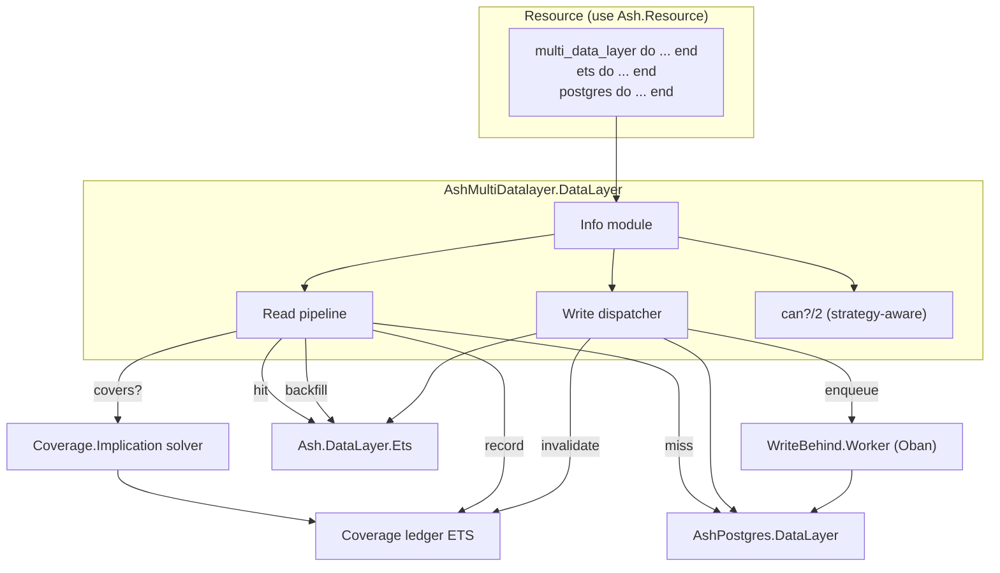

# RFC: `ash_multi_datalayer` — composable multi-layer Ash datalayer

**Status**: **Accepted — scope B with modifications (2026-04-17).** The document
below preserves the original draft plus the multi-perspective review synthesis
as historical context. See the "Accepted decisions" section immediately after
this header for the authoritative v1 design; the rest of the document is
reference material for why the final shape differs from the draft.

## Accepted decisions (2026-04-17)

After the multi-perspective review, the author selected **scope B**
(subsumption + synchronous writes only) with these modifications:

1. **Generic ordered layers**, not `:cache` / `:primary`. The DSL uses
   `layer :l1, module`, `read_order [:l1, :l2]`, `write_order [:l2, :l1]`,
   `backfill?`. Named strategy enums (`:cache_first`, `:write_through`,
   `:primary_only`) are removed — users compose behaviour from the lists.
   Rationale: caching is one use case; tiering and migration mirroring are other
   use cases the same library should serve without baking caching into the DSL.
2. **Filter subsumption retained.** Implemented via **per-attribute interval
   representation** (set-containment subsumption), not the SAT-style
   `Ash.Query.BooleanExpression` reduction in the draft. Architect
   recommendation: correctness is decidable without a general solver.
   Conservative-on-unknown means unsupported shapes fall through to "not
   covered," never to "covered" incorrectly.
3. **Row-aware invalidation ships in v1.** The draft's "drop everything for
   resource+tenant on any write" is rejected; under any write load it makes
   `:cache_first` strictly worse than a PK cache. v1 uses
   `Ash.Filter.Runtime.do_match/2` to drop only entries whose filter matches the
   changed row (before or after).
4. **`:write_behind` / Oban cut from v1.** Architect + skeptic reviewers found
   the latency win unquantified and the multi-node coherence story broken;
   operator flagged at-least-once duplication risk as blocking. Users who want
   asynchronous primary writes wire Oban in their actions directly. A separate
   RFC may reconsider `:write_behind` once the simpler library has real
   adopters.
5. **Single-node v1.** Cross-node cache coherence is a v2 design problem. A
   compile-time verifier forces explicit acknowledgement of the single-node
   assumption so users don't silently ship a broken multi-node configuration.
6. **`field_policies` + fall-through reads rejected** by a verifier. Per
   security review: broader cache populates can include fields that field
   policies would strip for a lower-privileged actor; v1 refuses this
   combination at compile time rather than returning leaked rows at runtime.
7. **Operator infrastructure v1-required**: ledger size cap + LRU eviction,
   divergence sampler, `:persistent_term`-backed runtime kill-switch, rich
   per-event telemetry with filter fingerprints, and `AshMultiDatalayer.Debug`
   helpers. None of these are deferrable.

The PRD, plan file, and downstream docs have been updated to match this shape.
The historical sections below are retained for audit.

---

**Status (historical)**: Draft — scope decision needed (resolved 2026-04-17)
**Author**: Barnabas Jovanovics **Created**: 2026-04-17 **Feedback deadline**:
2026-05-01 **Stakeholders**:

| Name                | Role                | Reviewed? | Concerns?                                                                           |
| ------------------- | ------------------- | --------- | ----------------------------------------------------------------------------------- |
| Barnabas Jovanovics | Author / maintainer | [x]       | —                                                                                   |
| Architect agent     | Synthetic reviewer  | [x]       | 1 blocking, 6 major (extension conflict, solver build-vs-buy, multi-node coherence) |
| Operator agent      | Synthetic reviewer  | [x]       | 3 blocking, 3 major, 1 minor (no divergence detector, at-least-once dupes, no cap)  |
| End-user agent      | Synthetic reviewer  | [x]       | 1 blocking, 5 major, 2 minor (read-your-writes, multitenancy gaps, mig story)       |
| Security agent      | Synthetic reviewer  | [x]       | 1 blocking, 2 major, 2 minor (field-policy bypass, tenant nil, ledger DoS)          |
| Skeptic agent       | Synthetic reviewer  | [x]       | 3 blocking, 4 major (do-nothing viable, scope too big, simpler shape ignored)       |

## TL;DR

Build `ash_multi_datalayer` as a single module that is **both** an
`Ash.DataLayer` implementation and a `Spark.Dsl.Extension`, composing exactly
two named layers (`:cache` = ETS, `:primary` = Postgres) configured by a new
`multi_data_layer do ... end` resource block. Reads consult a per-resource
**filter-subsumption coverage ledger** before falling through to the primary;
writes follow one of three strategies (`:write_through`, `:write_behind` via
**Oban**, `:primary_only`). Capability negotiation (`can?/2`) is
**strategy-aware**, not a flat intersection of all layers.

## Need / Problem Statement

Ash apps backed by Postgres routinely add ad-hoc caches in front of read-heavy
resources — usually `Cachex` or hand-rolled ETS calls inside
`before_action`/`after_action` hooks. This pattern has three persistent failure
modes:

1. **Coupling.** Every action that reads or writes the resource has to remember
   the cache. Adding a new action means re-implementing cache plumbing.
2. **Coverage opacity.** Per-PK caches are easy; list-read caches are not. Users
   cache the result of one filter and silently return stale results for a
   different filter that happens to overlap.
3. **Write coordination.** Write-through is tractable; write-behind almost
   always requires a job queue, and homegrown integrations are correctness
   minefields (lost updates, stale cache after permanent worker failure).

Evidence: this is folklore in the Ash community Slack and shows up regularly as
"how do I cache an Ash resource" questions on the Ash forum and elixirforum.
There is no first-party answer today; users either tolerate direct Postgres
reads or build per-app glue. A composable multi-datalayer solves all three
failure modes at the framework boundary.

## Approach / Proposed Solution

### Overview

A new library, `ash_multi_datalayer`, provides one module
(`AshMultiDatalayer.DataLayer`) that satisfies `Ash.DataLayer` and the
`Spark.Dsl.Extension` contract simultaneously — the same pattern
`AshPostgres.DataLayer` uses today. Resources opt in by setting
`data_layer: AshMultiDatalayer.DataLayer` and adding a
`multi_data_layer do ... end` block that names the cache and primary modules and
selects strategies.

The multi-datalayer's runtime behaviour is built around three pieces:

1. **A per-resource coverage ledger** (a sidecar ETS table) that records every
   filter previously materialised into the cache.
2. **An implication solver** that decides whether any ledger entry's filter
   logically implies the incoming query's filter. On a positive answer, the
   cache layer serves the read; otherwise the primary does, and its results
   backfill both the cache and the ledger.
3. **A write dispatcher** that routes create/update/destroy/upsert through one
   of three strategies, invalidates the ledger after every write, and (for
   `:write_behind`) enqueues the primary write through Oban.

### Architecture



### Key Design Decisions

1. **Single module, dual role.** Mirroring `AshPostgres.DataLayer`,
   `AshMultiDatalayer.DataLayer` is both the datalayer and the DSL extension.
   Splitting them would force the user to declare two extensions.

2. **Filter subsumption, not PK presence.** PK-presence handles only point
   lookups; per-query memoisation can't recognise equivalent filters. A small
   solver over a closed predicate set (`eq`, `not_eq`, `in`, `lt`/`lte`/`gt`/
   `gte`, `is_nil`, conjunctions, disjunctions) gives correct cache hits on
   filtered list reads. Anything outside the supported set short-circuits to
   "not covered" so the cache silently degrades to per-PK behaviour.

3. **Conservative solver.** "When in doubt, return `false`." False negatives
   cost a primary round-trip; false positives return wrong rows. A
   property-based test cross-checks the solver against a brute-force evaluator
   on a generated finite domain.

4. **Oban for write-behind, not `after_transaction`.** `after_transaction` gives
   no caller-visible latency win because the primary round-trip still happens
   before control returns. Oban defers the real write to a background worker,
   gives durability + retries + DLQ, and (importantly) **invalidates the
   affected cache row on permanent failure** so the cache can never diverge
   persistently from a missing primary write.

5. **Strategy-aware capabilities.** `can?(:transact)` follows the _synchronous_
   write targets, not all configured layers. A `:primary_only` write stack
   reports `:transact == true` even though the cache is non-transactional; a
   `:write_through` stack reports `false` because ETS is reachable on every
   write. Same logic applies to read-side capabilities like `{:aggregate, _}`.

6. **Conservative ledger invalidation.** Every successful write drops _all_
   ledger entries for the resource+tenant. Cheap and correct; row-specific
   invalidation is a fast follow-up once we have measurements.

### API / Interface Changes

New public surface (this is a new library; nothing existing changes):

```elixir
# lib/ash_multi_datalayer/data_layer.ex
defmodule AshMultiDatalayer.DataLayer do
  use Ash.DataLayer
  use Spark.Dsl.Extension, sections: [@multi_data_layer]
  # ... callbacks: resource_to_query/2, run_query/2, create/2, update/2,
  # destroy/2, upsert/3, filter/3, sort/3, limit/3, offset/3, can?/2,
  # transaction/4 (delegated when applicable)
end

# lib/ash_multi_datalayer/data_layer/info.ex
defmodule AshMultiDatalayer.DataLayer.Info do
  def layers(resource), do: ...
  def cache_layer(resource), do: ...
  def primary_layer(resource), do: ...
  def read_strategy(resource), do: ...
  def write_strategy(resource), do: ...
end

# lib/ash_multi_datalayer/coverage.ex
defmodule AshMultiDatalayer.Coverage do
  @callback covers?(resource :: module(), query :: Ash.Query.t()) :: boolean()
  @callback record(resource, query, loaded_fields) :: :ok
  @callback invalidate(resource, tenant) :: :ok
end
```

Resource-facing DSL (the only thing application authors see):

```elixir
multi_data_layer do
  layer :cache,   Ash.DataLayer.Ets
  layer :primary, AshPostgres.DataLayer

  read_strategy   :cache_first
  write_strategy  :write_behind
  cache_backfill? true

  oban_queue        :multi_datalayer_writes
  oban_max_attempts 5
end
```

### Data Model Changes

No persistent schema changes. Two pieces of in-memory state per resource:

- The **cache layer's ETS table** (created and owned by `Ash.DataLayer.Ets`, not
  us).
- The **coverage ledger ETS table**, owned by `AshMultiDatalayer.Coverage`,
  named `:"#{resource}.AshMultiDatalayer.Coverage"`. Each row is
  `{id :: reference(), filter :: Ash.Filter.t(), loaded_fields :: MapSet.t(atom), tenant :: term, loaded_at :: integer}`.
  *(Implementation note, 2026-07-03: as shipped, each entry stores **both** the
  raw `%Ash.Filter{}` — for runtime invalidation matching — and its normalised
  interval DNF — for implication — plus a dedupe fingerprint; see the technical
  doc's data model.)*

For `:write_behind`, we leverage Oban's existing `oban_jobs` table. We add no
new tables.

## Benefits

1. **Single-DSL-block opt-in.** A resource adopts caching by adding one DSL
   block, with no per-action plumbing. Replaces ad-hoc per-action cache code.

2. **Correct cache hits on filtered list reads.** Filter subsumption recognises
   that "`name == 'foo' and age > 18`" is implied by a previously-materialised
   "`name == 'foo'`", so the second read serves from cache.

3. **Real latency win for `:write_behind`.** Caller pays only the cache write
   plus an Oban `insert` (one short row), not the full primary round-trip with
   triggers/indexes.

4. **Strategy-aware capabilities** preserve primary-layer features (`:transact`,
   complex aggregates) when the cache is not on the operation's path. Naive
   intersection would silently disable transactions for `:primary_only` write
   stacks.

5. **Operationally honest failure handling.** Solver bugs degrade to cache
   misses; permanent worker failures invalidate the affected cache row. Neither
   failure mode produces stale reads.

## Alternatives Considered

### Alternative 1: Per-record presence cache (PK-only)

Cache stores rows by PK. Cache hit only claimed when filter reduces to a
PK-equality / PK-IN.

**Pros**: Trivial to implement, no solver, no ledger, no risk of incorrect
coverage claims. **Cons**: Filtered list reads always go to the primary; entire
categories of hot reads (`Posts.where(author_id: ^id)`) get no benefit. A common
reason people _want_ a cache. **Why not**: Strictly weaker than subsumption for
the same DSL surface; user explicitly preferred subsumption when given the
choice.

### Alternative 2: Per-query memoisation (serialised filter as key)

Sidecar ETS table keyed by serialised filter; a hit means "this exact filter has
been materialised."

**Pros**: Easier to implement than subsumption; no solver. **Cons**: Equivalent
filters in different syntactic shape miss; new filters miss even when
previously-loaded broader filters cover them. Invalidation is the same
complexity. Strict subset of subsumption's behaviour. **Why not**: We pay the
implementation cost of subsumption once for the better hit rate.

### Alternative 3: `:write_behind` via `after_transaction`

Schedule the primary write via `Ash.Changeset.after_transaction/2` instead of
Oban.

**Pros**: No new dependency. **Cons**: Caller still pays the primary round-trip
before control returns; no caller-visible latency win over `:write_through`. No
durability across restarts. No retry / DLQ semantics. **Why not**: Provides
essentially nothing over `:write_through` while adding ordering subtlety.
Explicitly rejected.

### Alternative 4: Hooks library, no datalayer (`AshCached`)

A library that ships `before_action` / `after_action` helpers to memoise PK
lookups in ETS and invalidate on writes. No DSL extension, no Spark transformer,
no coverage ledger.

**Pros**: ~300 LOC, ships in a weekend; satisfies US1's "Must" criteria
verbatim; no transitive extension installation; no field-policy interaction; no
multi-node coherence problem. **Cons**: PK lookups only (no list reads from
cache); per-action opt-in instead of per-resource; no write-behind story
(callers wire Oban themselves). **Why not (currently)**: doesn't satisfy FR2
(coverage check on filtered reads). **But**: surfaced strongly by skeptic review
and may become the v1 if author chooses to descope (see Synthesis section).

### Do Nothing

Continue letting users hand-roll caches inside actions with `Cachex` +
`before_action`. The status quo _works_ — apps run, code ships — and the skeptic
review argues this is in fact fine for most apps (Cachex + a hook is ~20 LOC per
resource).

**Counter-argument for acting**: each app reimplements the same wheel,
correctness varies wildly, and there is no place to fix bugs once. The author's
own current project hits exactly this shape.

**Honest tension**: the skeptic review notes that the RFC's problem statement is
anecdotal ("this shows up in Slack"), not measured. We have not quantified the
gap between "hand-rolled cache" and `ash_multi_datalayer` in latency, bug count,
or developer hours. This is a real weakness of the case for action.

## Risks and Drawbacks

Originally-identified risks (kept as-is, mitigations holding):

- **Solver correctness is the headline risk.** A wrong `implies?/2` returns
  stale rows silently — the worst possible failure mode for a cache.
  _Mitigation_: conservative-by-default ("unknown → false"), property-based test
  suite cross-checking against a brute-force evaluator, explicit predicate
  allow-list. **Architect addendum**: property tests don't prove correctness on
  adversarial input. Consider switching to a strict per-attribute interval
  representation (containment-by-set-subset) instead of
  `Ash.Query.BooleanExpression`-based generality; it's decidable in O(predicates
  × attrs) without a solver.

- **Cache stampede.** Two concurrent cold reads for the same filter both miss
  the ledger, both hit the primary, both backfill. _Mitigation_: not solved in
  v1 (documented). Future work: per-filter request coalescing.

Risks **upgraded after review** (mitigations were too soft):

- **Ledger invalidation is destructive on write-heavy workloads.** Dropping all
  entries for a resource+tenant on every write means `:cache_first` silently
  degrades to `:primary_only` plus overhead under sustained writes. Architect
  calls this "strictly worse than a pure-PK cache under write load." _Revised
  mitigation_: emit `[:ash_multi_datalayer, :ledger, :invalidated]` with count
  metadata so this is _visible_, and recommend `:cache_first` only after
  measurement. Row-aware invalidation should be reconsidered for v1, not
  deferred.

- **Coverage ledger is uncapped — DoS via filter churn.** Security and operator
  both flagged this as **blocking**. v1 must ship with a hard cap on ledger rows
  per resource (default 10 000), LRU eviction by `loaded_at`, and
  `[:ash_multi_datalayer, :ledger, :evicted | :ledger_full]` telemetry.
  "Documented operational warning" is not a v1-acceptable mitigation.

- **Multitenancy isolation rests on ledger `tenant` field correctness.**
  Security review: the RFC never specifies how `tenant` is extracted from the
  incoming `Ash.Query`, what happens when `tenant` is `nil`, or whether the
  cache and primary layers' multitenancy strategies must match. _Required
  additions_: (a) sentinel for `nil` tenant distinct from any real tenant; (b)
  verifier that rejects mixed multitenancy strategies between `:cache` and
  `:primary`; (c) property test generating cross-tenant filter pairs and
  asserting `covers?/2` returns `false`.

- **Oban is a heavy dependency for `:write_behind`.** _Mitigation_:
  `optional: true`, verifier rejects use without Oban.

- **DSL bleed / underlying-extension conflict.** Architect (**blocking**):
  `Ash.DataLayer.Ets` and `AshPostgres.DataLayer` both register transformers
  that assume exclusive ownership of the resource —
  `mix ash_postgres.generate_migrations` will see a multi-datalayer resource
  that also has `ets` config and behaviour is undefined. _Required_: prototype
  the two-pass extension injection on a throwaway branch; if it requires forking
  Spark, split into `AshMultiDatalayer.DataLayer` (callbacks) +
  `AshMultiDatalayer.Extension` (DSL). Add an integration test that runs
  `mix ash_postgres.generate_migrations` against a multi-datalayer resource.

Risks **introduced by reviewers** (not in original draft):

- **Field-policy bypass — security blocking.** Ash's `field_policies` redact
  per-attribute per-actor _after_ the datalayer returns rows. A broader cache
  populate (e.g., admin reads with no filter) can include fields that field
  policies would strip for a lower-privileged actor. The subsumption solver will
  then serve the narrower-actor read from the cache, bypassing field redaction
  entirely. _Required_: choose one — (a) verifier rejects any resource with
  `field_policies` from declaring `read_strategy :cache_first`; (b) include
  actor identity (or a policy fingerprint) in the ledger key; (c) document the
  incompatibility prominently. Option (a) is the safest v1 choice.

- **Write-behind at-least-once duplicates corrupt non-idempotent writes —
  operator blocking.** Oban gives at-least-once delivery; a worker can succeed
  against the primary and crash before marking the job done, causing a retry.
  For `:update` actions with non-idempotent semantics (counters, append-only
  lists, triggers fired on UPDATE) this silently corrupts data. _Required_:
  deterministic idempotency key on the job payload (e.g.,
  `{resource, pk, changeset_fingerprint, caller_monotonic}`); worker checks
  against an `applied_jobs` table or `ON CONFLICT DO NOTHING` before executing;
  document which operation shapes are safe.

- **Cross-node cache coherence on `:write_behind` — architect major.** The
  "read-your-writes through the cache" claim holds only on the _writing_ node.
  Other nodes' caches stay stale until their ledger expires (which v1's "drop
  everything on write" doesn't do, because the write was on another node).
  _Required_: either declare `:write_behind` single-node-only in v1 (with
  verifier check on application config), or require `Phoenix.PubSub`
  invalidation broadcasts. Same problem applies in a weaker form to
  `:write_through` if peers don't see the write.

- **No cache-vs-primary divergence detector — operator blocking.** No way to
  detect or alarm on stale reads in production. _Required_: shadow-read sampler
  (1% of `:cache_first` reads re-issued against primary, set equality asserted)
  emitting `[:ash_multi_datalayer, :read, :divergence_detected]`. Opt-in per
  resource; on-by-default in the recommended-config guide.

- **Read-your-writes inversion under mixed strategies — end-user blocking.**
  Under `:write_behind`, a `:cache_first` reader on the writing node sees the
  new value immediately while a `:primary_only` reader (e.g., an admin report or
  a code path that bypasses Ash) sees the pre-write value for as long as Oban is
  backed up. This _will_ cause production bugs. _Required_: enumerate
  "operations that bypass the cache and therefore see pre-write state"
  prominently in the guide; consider a verifier warning when a resource declares
  both `:write_behind` and any `:primary_only`-overriding action.

- **No runtime kill-switch — operator major.** Today, the only way to bypass the
  cache is to change the DSL and recompile. Unusable at 3 AM. _Required_:
  `:persistent_term` or `:application` env-backed per-resource flag checked in
  `run_query/2` so an operator can disable the cache layer-of-the-multilayer in
  under a minute without a deploy.

- **Strategy is per-resource, not per-action — architect major.** A bulk
  reimport that wants `:primary_only` while everyday reads want `:cache_first`
  cannot be expressed today. _Required_: action-level override via
  changeset/query context key; document that `can?/2` reflects the resource
  default only.

- **Migration story understates the diff — end-user major.** Switching
  `data_layer:` changes the module identity, which breaks any third-party
  extension that pattern-matches on the datalayer module (paper-trail, archival,
  custom policies). _Required_: enumerate known third-party extensions and their
  compatibility; show a real before/after diff for a non-trivial resource in the
  guide.

- **PII in Oban job payloads — security minor.** The worker reconstructs the
  changeset from the job payload (resource, tenant, pk, attribute diff). The
  diff lands in `oban_jobs` with whatever retention/replication posture Oban
  has, which often differs from the primary tables and may include password
  hashes, tokens, or other sensitive attributes. _Required_: per-resource
  `redact_attributes` list (or honour an `Ash.Resource.Attribute :sensitive?`
  flag); redacted attributes are re-fetched server-side rather than transported
  through the job.

- **Telemetry leaks PII — security minor.** "Never log full filter contents" is
  advisory, not enforceable. _Required_: emit a stable _filter fingerprint_
  (structural hash with literal values replaced by type tags) in default
  telemetry; gate raw filter contents behind a compile-time `:debug_filters`
  flag that defaults off.

- **Observability is too coarse to debug anything — operator major.** Four
  events with no per-event metadata can't answer "which resource regressed, what
  filter shape, why was it a miss." _Required_: every event carries
  `%{resource, tenant, filter_shape_hash, strategy}` metadata and
  `%{duration_us, ledger_size, ledger_hits_considered}` measurements; distinct
  events for `:ledger_invalidated`, `:solver_unsupported`, `:backfill_rows`,
  `:worker_retry`, `:dlq_landed`.

- **No local repro story for stale reads — operator major.** _Required_:
  `AshMultiDatalayer.Debug` with `dump_ledger/1`, `explain_covers?/2` returning
  a solver decision trace, and a Mix task for ad-hoc inspection. Document Oban
  `:inline` testing mode for write-behind in the guide.

## Rollout Strategy

This is a new library, not a change to a running service.

- **Feature flag**: N/A. The library is opt-in per resource via the
  `data_layer:` setting.
- **Phased rollout** (per host application):
  1. Switch one read-mostly resource's `data_layer:` and add the DSL block with
     `read_strategy :primary_only` / `write_strategy :primary_only` —
     behavioural no-op, proves the wiring.
  2. Flip `read_strategy :cache_first`; observe telemetry.
  3. Flip `write_strategy :write_through` (or `:write_behind` if Oban is already
     present).
- **Rollback plan**: revert the two DSL options or revert the `data_layer:`
  switch. The library owns no persistent state outside the runtime ETS table,
  which is recreated on boot.
- **Monitoring**: telemetry events
  `[:ash_multi_datalayer, :read, cache_hit | cache_miss | primary_fallthrough]`
  and `[:ash_multi_datalayer, :write, sync | enqueue | failed]`. Operators wire
  these into existing dashboards.

## Cross-Cutting Concerns

- **Security** (substantially expanded after security review):
  - _Field-policy bypass_ (**blocking**) — see Risks. Trust boundary: this
    datalayer sees post-policy filters, not actors. It does **not** enforce
    authorization and must not be trusted to.
  - _Tenant isolation_: ledger and cache must never serve a row from one tenant
    to another. The cache's multitenancy story is inherited from the cache
    layer; the _ledger_ is our own ETS table, so tenant correctness is on us.
    Sentinel for `nil` tenant; verifier rejecting mixed multitenancy strategies;
    property test on cross-tenant filter pairs.
  - _Memory exhaustion as DoS_: hard cap + LRU eviction + `:ledger_full`
    telemetry are v1-required. "Documented warning" is rejected.
  - _PII in Oban payloads_: per-resource `redact_attributes` list (or honour
    `:sensitive?` on attributes); redacted attributes re-fetched on the worker,
    not transported via the job.
  - _Telemetry leakage_: filter fingerprints by default; raw filter contents
    only behind a compile-time `:debug_filters` flag.

- **Performance**:
  - Cache hit on a PK lookup: target p99 ≤ 200µs through our routing overhead,
    dominated by ETS itself.
  - Solver: target p99 ≤ 500µs per `covers?` call on filters with ≤ 10
    predicates. Will benchmark before merge.
  - `:write_behind` caller: pays cache write (microseconds) + Oban `insert_all`
    (a few ms on the same Postgres pool); real primary write deferred.

- **Observability**: telemetry as above. Logs at `:debug` level for cache
  hit/miss decisions; never log full filter contents at higher levels (PII
  risk).

- **Backwards compatibility**: N/A — new library. Once published, the DSL
  surface and Info API are stable contracts; breaking them requires a major
  version bump.

## Open Questions

**Consequential decisions raised by review (require author input before
implementation can begin):**

1. **v1 scope.** Skeptic + architect + operator independently argue that the
   originally-planned v1 is too ambitious. Three options on the table:
   - **A: Ship as planned**, addressing the blocking findings inline (field
     policies, extension conflict, divergence sampler, idempotency keys, ledger
     cap, multi-node coherence). Material extra scope: ~40–60% more work than
     the original plan.
   - **B: Subsumption + write-through only.** Drop `:write_behind` from v1
     entirely; add it back in v2 once Oban + cross-node coherence is designed
     properly. Keeps the interesting solver work; defers the interesting queue
     work.
   - **C: PK presence + write-through only.** Drop subsumption entirely for v1.
     Ships in ~1 week instead of months. Treat subsumption as a research project
     that gets a separate RFC once the simpler library has real users.
   - **D: Hooks library, no datalayer.** Skeptic's "simpler version of this RFC"
     — `before_action`/`after_action` helpers for PK memoisation. ~300 LOC,
     ships in a weekend. Doesn't satisfy FR2 but satisfies US1.

2. **Field-policy compatibility.** Reject `:cache_first` for resources with
   `field_policies`, include actor in ledger key, or document incompatibility?
   Author decision required.

3. **Multi-node deployments.** Single-node-only v1, or require `Phoenix.PubSub`
   invalidation? If the host app is single-node we can defer; if multi-node is
   in scope, this is a v1 design decision, not a follow-up.

4. **Ledger invalidation granularity.** Operator + architect both push for
   row-aware invalidation in v1, not "drop everything." Worth pulling forward?

**Smaller open items (resolvable inline, not blocking the scope decision):**

5. `:write_behind` payload shape (full row vs diff). Prior art search needed in
   the Ash + Oban world.
6. Telemetry naming: `[:ash_multi_datalayer, …]` vs
   `[:ash, :data_layer, :ash_multi_datalayer, …]`.
7. Compile-time `Oban.Worker` typecheck on the configured worker module.
8. Cache write in `:write_through`: inside or outside the primary transaction?
9. Naming: end-user reviewer flagged `:primary` as overloaded with
   replica/replica-set semantics. `:source_of_truth`? `:backing`? Stick with
   `:primary`?

## Synthesis from multi-perspective review

Five reviewer perspectives surfaced **9 blocking** and **20 major** findings.
The pattern across reviewers is consistent: the proposal is _interesting_
(solver, strategy-aware capabilities, named layers) but _over-scoped_ for a v1
of a library with no users yet. Three independent reviews (skeptic, architect,
operator) suggested descoping — for different reasons that converge on the same
shape.

**Themes:**

- **Correctness gaps the original draft missed**: field-policy bypass
  (security), cross-node coherence on `:write_behind` (architect), at-least-once
  duplication (operator). Each of these would cause real production bugs and is
  not addressed by the existing design.
- **Operational blindness**: no divergence detector, no runtime kill-switch,
  coarse telemetry, no local repro story. The design is correct-by-prose; the
  prose is not provable in production.
- **Scope vs. value**: the highest-value 80% of the use case (PK lookups served
  from cache) is achievable in a fraction of the proposed work. The remaining
  20% (filtered list reads via subsumption) is months of solver
  - ledger + invalidation engineering with no user yet asking for it.
- **DSL mechanics under-specified**: the transitive extension install, ledger
  ETS lifecycle across code reload, and `mix ash_postgres.generate_migrations`
  interaction are all unverified. Architect calls these out as compile-order
  footguns; one is **blocking**.

**Recommendation to author** (Barnabas): pick a scope option from Open Question
1 before proceeding to ADR / plan-doc / tasks. Option A keeps the ambition but
multiplies the implementation budget; B is the smallest defensible "we shipped
the interesting part"; C is the smallest defensible "we shipped a useful
library"; D is the smallest defensible "we solved the problem."

The PRD, plan-doc, tasks, technical doc, and runbook generated downstream of
this RFC will need to be redone if the scope option changes, so this decision is
gating the rest of the `/feature-docs all` pipeline.

## References

- [PRD](./ash-multi-datalayer-prd.md)
- Approved plan: `/home/joba/.claude/plans/the-idea-is-to-cozy-hinton.md`
- `Ash.DataLayer` behaviour: <https://hexdocs.pm/ash/Ash.DataLayer.html>
- `Spark.Dsl.Extension`: <https://hexdocs.pm/spark/Spark.Dsl.Extension.html>
- `Oban.Worker`: <https://hexdocs.pm/oban/Oban.Worker.html>
- Reference implementation pattern: `ash_postgres/lib/data_layer.ex`

---

**Last Updated**: 2026-07-03
