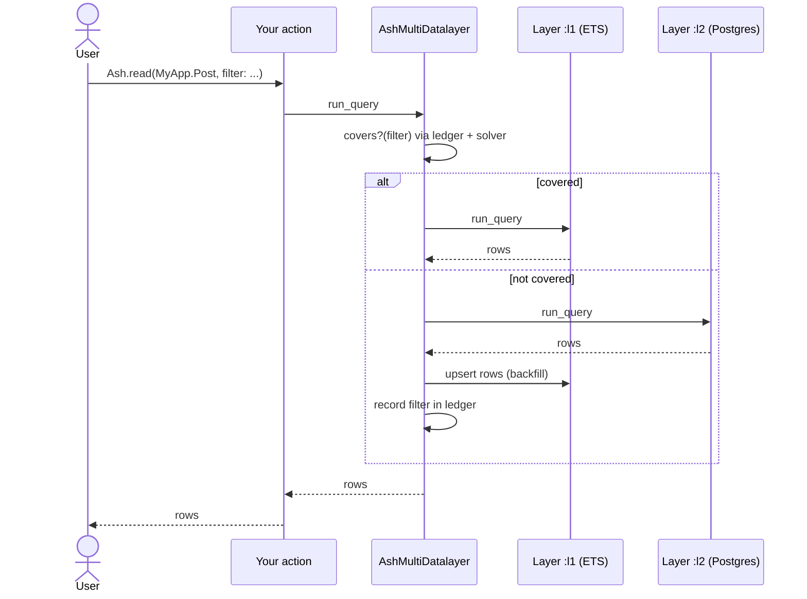

# `ash_multi_datalayer`

## What This Is

`ash_multi_datalayer` lets you put multiple data stores behind a single Ash
resource. The most common use is caching: keep a hot copy of your Postgres data
in ETS and serve reads from there without writing per-action cache code. The
same library also covers other layered patterns — cold-storage tiering,
migration mirroring, polyglot persistence — because the DSL is generic ordered
layers, not cache-specific.

You opt in by changing the `data_layer:` line (plus an `extensions:` entry for
layers that need configuring) and adding one DSL block to your resource. No
changes to your actions.

## Prerequisites

Before you start, make sure you have:

- Ash `~> 3.0` and AshPostgres `~> 2.0` in your project.
- A working Postgres-backed Ash resource you want to layer.
- `config :ash_multi_datalayer, :assume_single_node, true` in
  `config/config.exs`. v1 is single-node only; this line acknowledges the
  limitation. If your app runs on multiple nodes, this library is not yet the
  right fit — see the
  [single-node ADR](../design/20260417-single-node-v1-adr.md).

## Quick Start

Switch a resource to use `AshMultiDatalayer.DataLayer` as a drop-in for
`AshPostgres.DataLayer`, then flip it into cache-through mode:

1. Add `{:ash_multi_datalayer, "~> 0.1"}` to `mix.exs` and run `mix deps.get`.
2. Add `AshMultiDatalayer.Supervisor` to your application's supervision tree
   (same file as your other supervisors):

   ```elixir
   children = [
     # ... your existing children
     AshMultiDatalayer.Supervisor
   ]
   ```

3. Change the resource's `data_layer:` and add the DSL block:

   ```elixir
   use Ash.Resource,
     domain: MyApp.Domain,
     data_layer: AshMultiDatalayer.DataLayer,   # was: AshPostgres.DataLayer
     extensions: [AshPostgres.DataLayer]        # keeps the postgres section available

   multi_data_layer do
     layer :l1, Ash.DataLayer.Ets
     layer :l2, AshPostgres.DataLayer

     read_order  [:l1, :l2]     # try l1 first, fall through to l2
     write_order [:l2, :l1]     # write l2 first, then l1
   end

   postgres do
     table "tweets"    # unchanged from before
     repo  MyApp.Repo
   end
   ```

   Note the `extensions: [AshPostgres.DataLayer]` line: the library cannot
   install underlying DSL sections automatically (Spark resolves extensions at
   `use` time), so you list a layer's extension yourself when its DSL section
   has required options — AshPostgres does (`table`, `repo`). Layers whose
   sections work from defaults (like `Ash.DataLayer.Ets`) need no entry; add one
   only if you want to configure them. If you forget a required extension, the
   `ValidateLayers` verifier tells you exactly what to add.

That's it. Reads now consult the ETS cache first and fall through to Postgres on
a miss (backfilling the cache — backfill is always on for multi-layer
`read_order`). Writes go to Postgres first, then to ETS. No per-action code
changes.

## How to Use It

### How to switch an existing resource to the multi-datalayer

1. Change `data_layer: AshPostgres.DataLayer` to
   `data_layer: AshMultiDatalayer.DataLayer`, and add
   `extensions: [AshPostgres.DataLayer]` so the `postgres` section stays
   available.
2. Add the `multi_data_layer do ... end` block.
3. Keep your existing `postgres do ... end` block verbatim.
4. Run `mix compile` — if verifiers complain, fix the reported issue (most
   often: missing `:assume_single_node` ack, a missing underlying extension, or
   `field_policies` incompatibility).
5. Run `mix ash_multi_datalayer.generate_migrations` (or `mix ash.codegen`,
   which the library hooks into) — it produces the same migrations as before the
   switch. Don't use the stock `mix ash_postgres.generate_migrations` directly:
   it discovers resources by data-layer equality and silently skips
   multi-datalayer resources.
6. Run your existing tests — nothing should change yet (because `read_order`
   defaults to fall-through but the cache is empty on first boot).

### How to pick a layering pattern

The DSL is `read_order` + `write_order`. Common patterns:

| Goal                               | `read_order` | `write_order` |
| ---------------------------------- | ------------ | ------------- |
| Read-through cache (most common)   | `[:l1, :l2]` | `[:l2, :l1]`  |
| Primary-only reads (kill-switch-y) | `[:l2]`      | `[:l2, :l1]`  |
| Dual-write mirror                  | `[:l1]`      | `[:l1, :l2]`  |
| Read the cache, ignore primary     | `[:l1]`      | `[:l1]`       |

There is no `backfill?` option (removed 2026-07-03): backfilling is always on
for multi-layer `read_order` fall-throughs, and the non-caching patterns above
that used `backfill? false` have a single-layer `read_order`, which skips
coverage — and therefore backfill — entirely.

`:l1` and `:l2` are just names you picked. Use different names if it reads
better for your use case (e.g. `:fast` / `:slow`).

### How to pick a strategy (orchestrator)

The layer list says _where_ the data lives; the **orchestrator** says _how_
reads and writes are routed across those layers. It is a behaviour
(`AshMultiDatalayer.Orchestrator`) resolved per resource, so the same data layer
supports more than one policy:

| Strategy                       | Reads                                            | Writes                                                                                | Use it for                                         |
| ------------------------------ | ------------------------------------------------ | ------------------------------------------------------------------------------------- | -------------------------------------------------- |
| **`ProvenCoverage`** (default) | fall through `read_order`, backfilling on a miss | propagate across `write_order`                                                        | a read-through cache in front of a source of truth |
| **`LocalOutbox`**              | served entirely from a **local** layer (0 RPC)   | commit locally + co-commit an outbox entry an Oban worker flushes to the target later | offline-first / local-authoritative apps           |

`ProvenCoverage` is implied when you only set `read_order`/`write_order`. Opt
into `LocalOutbox` explicitly:

```elixir
multi_data_layer do
  orchestrator {AshMultiDatalayer.Orchestrator.LocalOutbox,
    outbox_resource: MyApp.Sync.OutboxEntry,
    conflict_detection: {:stale_check, :updated_at},
    hydrate: :manual}

  layer :local, AshSqlite.DataLayer
  layer :remote, AshRemote.DataLayer
  read_order [:local]           # every read is local — no network on the hot path
  write_order [:local, :remote] # local is authoritative; :remote is the replication target
end
```

Generate the outbox resource and its migration with
`mix ash_multi_datalayer.gen.outbox`. A flush whose target row moved since this
client last saw the `conflict_detection` field is **parked** as a `:conflict`
carrying a three-way snapshot (local / base / remote); resolve it with
`LocalOutbox.force/1` (mine wins), `discard_local/1` (theirs win), `retry/1`, or
`rebase/2`. Pause/resume the queue with `LocalOutbox.pause_sync/1` /
`resume_sync/1` (the "go offline" toggle), and poll per-record state with
`LocalOutbox.status/1`.

### How inbound changes reach a client (realtime)

Both strategies converge on inbound changes through one seam:
`Orchestrator.handle_external_change/2`. Add the strategy-agnostic notifier
`AshMultiDatalayer.Notifiers.ExternalChange` to a resource whose transport
replays server-side changes as Ash notifications (e.g. `AshRemote.Realtime`),
and each change is routed to the resource's strategy:

- **`ProvenCoverage`** invalidates the covered rows → the next read refetches.
- **`LocalOutbox`** refreshes that row into the local authority, **skipping any
  PK with unflushed local edits** (the dirty-chain rule) → an online replica
  converges instantly, while an offline client's pending edits are preserved to
  surface as a conflict on resume.

One notification stream, two strategy-appropriate reactions. Pair it with an
app-level notifier that tells your LiveViews to re-render.

### How to disable the cache at runtime without a deploy

When something goes wrong in production, flip the kill-switch:

1. In `iex` attached to the running node:

   ```elixir
   AshMultiDatalayer.disable!(MyApp.Post)
   ```

2. Or via a Mix task:

   ```bash
   mix ash_multi_datalayer.disable MyApp.Post
   ```

All reads for that resource now route only to the last layer in `read_order`,
and writes only to the first layer in `write_order` — both the source of truth —
skipping the cache layer entirely. Ledger invalidation still runs on writes
while disabled, so re-enabling can't serve coverage recorded before the switch
was flipped. Re-enable with `AshMultiDatalayer.enable!/1`.

### How to see what's in the cache

```elixir
# Dump all ledger entries for a resource (optionally filtered by tenant)
AshMultiDatalayer.Debug.dump_ledger(MyApp.Post)

# Explain why a specific query hit or missed the cache
AshMultiDatalayer.Debug.explain_covers?(
  MyApp.Post,
  Ash.Query.for_read(MyApp.Post, :read) |> Ash.Query.filter(active == true)
)
```

`explain_covers?/2` returns a trace that tells you, for each ledger entry,
whether it could have covered the query and (if not) why. Use this when your
cache hit rate is lower than expected.

### How to wire telemetry into your dashboard

```elixir
:telemetry.attach_many(
  "my-app-ash-mdl",
  [
    [:ash_multi_datalayer, :read, :hit],
    [:ash_multi_datalayer, :read, :miss],
    [:ash_multi_datalayer, :read, :backfill],
    [:ash_multi_datalayer, :read, :divergence_detected],
    [:ash_multi_datalayer, :write, :applied],
    [:ash_multi_datalayer, :write, :failed_at_layer],
    [:ash_multi_datalayer, :ledger, :invalidated],
    [:ash_multi_datalayer, :ledger, :evicted],
    [:ash_multi_datalayer, :ledger, :full]
  ],
  &MyApp.Telemetry.handle_ash_mdl/4,
  %{}
)
```

Every event carries metadata
`%{resource, tenant, filter_fingerprint, read_order, write_order}`. Measurements
(and extra metadata) are per-event:

| Event                           | Measurements                    | Extra metadata                                                                                                       |
| ------------------------------- | ------------------------------- | -------------------------------------------------------------------------------------------------------------------- |
| `[:read, :hit]`                 | `%{duration_us, ledger_size}`   | —                                                                                                                    |
| `[:read, :miss]`                | `%{duration_us, ledger_size}`   | `reason: :no_coverage_entry \| :solver_unsupported \| :fields_insufficient \| :not_cacheable \| :ledger_unavailable` |
| `[:read, :backfill]`            | `%{duration_us, ledger_size}`   | `count` (rows backfilled)                                                                                            |
| `[:read, :divergence_detected]` | `%{cache_count, primary_count}` | `pk_delta`                                                                                                           |
| `[:write, :applied]`            | `%{duration_us, ledger_size}`   | `operation`, `dropped_count`                                                                                         |
| `[:write, :failed_at_layer]`    | `%{}`                           | `operation`, `layer`, `reason`                                                                                       |
| `[:ledger, :invalidated]`       | `%{count, ledger_size}`         | —                                                                                                                    |
| `[:ledger, :evicted]`           | `%{ledger_size}`                | —                                                                                                                    |
| `[:ledger, :full]`              | `%{ledger_size}`                | —                                                                                                                    |

See the [technical deep-dive](../technical/ash-multi-datalayer.md) for the full
schema.

### How to tune ledger cap and divergence sampler per resource

```elixir
multi_data_layer do
  # ...
  ledger_max_entries 20_000   # more memory for hot tables
  divergence_sampler 0.05     # 5% shadow-reads for higher-risk tables
end
```

Defaults are 10 000 entries and 0.0 — the sampler is **off by default** and
opt-in. It is a probabilistic canary (a dev tool, or opt-in production tracing),
not a guarantee, and it costs an extra lower-layer request per sampled read.
Raise the cap when you hit `[:ledger, :full]` telemetry; turn the sampler on
(e.g. `0.01`) when divergence detection is operationally important.

### What gets cached (and what never does)

Some queries are served normally but never recorded into the coverage ledger or
backfilled, because a truncated or computed result cannot prove complete
coverage of its filter:

- queries with `limit`, `offset > 0`, `distinct`, `distinct_sort`, or `lock`
  (locks additionally bypass coverage entirely, missing with reason
  `:not_cacheable`).

Reads that **load calculations** get a _computed-value merge read_ (see the
20260703 ADR): when the row filter is covered, the rows are served from the
cache and ONE narrow query (`primary_key in [...]`, selecting only the PK plus
the calculations) fetches the computed values from the source of truth and
merges them in — hits carry `computed_values: :merged` metadata. Computed values
are never cached; they are fetched fresh on every read that loads them. If a
cached row has no source counterpart (an out-of-band delete), the merge is
abandoned and the whole query falls through fresh (miss reason `:stale_cache`).
The rows fetched by a calculation-carrying miss are backfilled and recorded like
any other read.

**Resource (relationship) aggregates are loudly unsupported** on multi-layer
resources: SQL layers build the related subquery via the destination resource's
data layer — which is this library — so the aggregate would be silently
`NotLoaded`. `can?({:aggregate, _})` is `false`, making Ash raise at query build
instead. Self-aggregation (`Ash.count/2` etc.) works and routes to the source of
truth; remote-style aggregates (e.g. ash_remote's, which arrive as calculations)
are unaffected.

Limited/offset probes **are** still served from previously recorded unlimited
coverage — the cache layer applies sort/limit/offset itself. Field coverage is
tracked as the recorded query's select plus the primary key; a probe only hits
when its fields are a subset of what was recorded. Finally, **upserts** have no
reliable before-image, so an upsert drops the entire tenant partition of the
ledger — the only provably safe option.

## Visual Walkthrough



Reads try the cache, fall through to Postgres on a miss, and backfill so the
next read for the same (or a covered) filter hits the cache.

## Common Questions

### Does this replace my existing Postgres-side caching?

No — `ash_multi_datalayer` layers ETS (in-process) in front of AshPostgres.
Postgres-side caching (materialised views, `pg_cron` refresh) is orthogonal and
can coexist with this library.

### What happens if `:l1` (ETS) goes down?

ETS is in-process; "going down" means the owning process crashed. The supervisor
restarts the `Coverage.TableOwner`, which creates a fresh table. The cache is
empty; reads fall through to `:l2` and warm it back up. No data is lost because
the cache is never the source of truth.

### Does the cache survive a deploy?

No. ETS tables don't survive BEAM restarts. Every deploy means a cold cache
storm until it warms back up. Warmup helpers are a potential follow-up; for now,
plan your rollouts accordingly.

### Can I use this with multiple nodes?

Not in v1. See the [single-node ADR](../design/20260417-single-node-v1-adr.md).
Multi-node coherence is a v2 design problem.

### Can I use this with `field_policies`?

Not with a multi-layer `read_order`. The solver reasons about row-level filters,
not actor-level field redaction; serving a cached row that was populated by a
broader (higher-privilege) read would bypass field redaction for a
lower-privilege reader. A compile-time verifier blocks the combination. If you
need both, use `read_order [:l2]` (no cache on reads); writes to the cache are
still safe.

### What about write-behind?

Not in v1. See the
[no-write-behind ADR](../design/20260417-no-write-behind-in-v1-adr.md). If you
want asynchronous primary writes, wire Oban in your action directly.

## Troubleshooting

### Compile error: "ash_multi_datalayer v1 is single-node-only"

**Fix**: Add to `config/config.exs`:

```elixir
config :ash_multi_datalayer, :assume_single_node, true
```

**Why it happens**: The `RejectMultiNode` verifier warns unless you acknowledge
the single-node limitation. This avoids silently shipping a broken multi-node
config. If you actually are multi-node, don't set this — the library isn't right
for you yet.

### Compile error: "uses `field_policies` with read_order [...]"

**Fix**: Either drop `field_policies` from the resource, or set
`read_order [:l2]` (single-layer reads, cache bypass).

**Why it happens**: A cached row populated by a higher-privilege read would
bypass field redaction for a lower-privilege reader. The library refuses the
combination.

### Cache hit rate is 0 % or very low

**Fix**:

1. `AshMultiDatalayer.Debug.dump_ledger(MyApp.Post)` — does the ledger have
   entries?
2. `AshMultiDatalayer.Debug.explain_covers?(MyApp.Post, query)` — does it trace
   to `:solver_unsupported` for the filter shapes you use most?
3. Check `[:ash_multi_datalayer, :ledger, :invalidated]` telemetry counts — if
   writes are dropping entries aggressively, row-aware invalidation might still
   be clearing a lot for your workload.

**Why it happens**: Either your filters include predicates the v1 solver can't
reason about (fragments, custom functions, relationship filters, array
operators), or writes are hitting ledger entries. The solver is intentionally
conservative — unsupported shapes always miss.

### `[:ash_multi_datalayer, :ledger, :full]` firing

**Fix**:

1. Raise `ledger_max_entries` for the affected resource.
2. Audit upstream: is an unauthenticated endpoint accepting user-supplied filter
   shapes? Validate or rate-limit at the action layer.

**Why it happens**: Every novel filter shape creates a ledger entry. LRU evicts
the oldest, so no crash, but eviction rate this high signals either genuine
workload growth or a buggy client churning filters.

### Divergence detected

**Fix**:

1. Note the `filter_fingerprint` and `pk_delta` in telemetry metadata.
2. `AshMultiDatalayer.disable!(MyApp.Post)` to stop the bleeding.
3. Reproduce locally: load that filter, dump ledger, compare against primary.

**Why it happens**: Either the solver claimed coverage it didn't have (solver
bug — file an issue with the fingerprint), or invalidation missed an entry
(invalidation bug — same). Either way, the sampler did its job: you know
_before_ a user reports it.

## Tips and Best Practices

- **Start with `read_order [:l2]` + `write_order [:l2]`.** Behavioural no-op —
  proves the wiring and migration tooling works. Flip to cache-through after a
  day of running that way.
- **Consider turning on the divergence sampler during rollout.** It is off by
  default (0.0) because every sampled read costs an extra lower-layer request;
  an opted-in 1 % is cheap and catches solver bugs before users do.
- **Set a ledger cap you can afford.** 10 000 entries × two layers × per-tenant
  can add up; budget before enabling on a tenant-sharded table.
- **Don't cache resources with `field_policies`.** The library refuses at
  compile time; listen to it.
- **Watch the invalidation rate.** If writes drop > 50 % of ledger entries on
  average, your workload's filter shapes are too broad — narrow them or accept
  that cache hit rate will suffer.
- **Kill-switch is production-grade.** Use it when things go wrong; it's
  designed for it.

## What's Next

- [Runbook](../runbooks/ash-multi-datalayer.md) — operational procedures.
- [Technical deep-dive](../technical/ash-multi-datalayer.md) — how it works
  under the hood.
- [Testing strategy](../testing/ash-multi-datalayer.md).

## Technical Details

For developers who want to understand how this works:

- [PRD](../design/ash-multi-datalayer-prd.md)
- [RFC](../design/ash-multi-datalayer-rfc.md)
- ADRs in [`docs/design/`](../design/).

---

**Last Updated**: 2026-07-03
