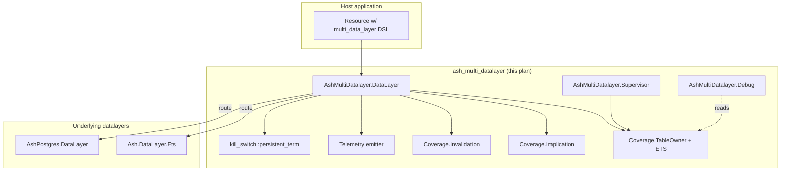
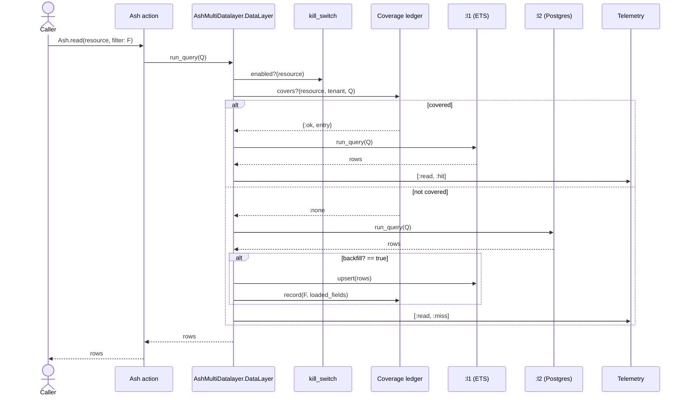

# `ash_multi_datalayer` Implementation Plan

**Metadata:**

- Type: plan
- Status: active
- Created: 2026-04-17
- Topic: ash-multi-datalayer
- PRD: [link](../design/ash-multi-datalayer-prd.md)
- RFC: [link](../design/ash-multi-datalayer-rfc.md)
- Approved design source:
  `/home/joba/.claude/plans/the-idea-is-to-cozy-hinton.md`

## Executive Summary

- **Feature**: Generic ordered layered `Ash.DataLayer` with filter-subsumption
  coverage, row-aware invalidation, synchronous writes, and first-class operator
  tooling (ledger cap, divergence sampler, runtime kill-switch, rich telemetry).
- **Complexity**: High — bespoke interval solver, per-resource ETS lifecycle,
  transitive DSL extension install, multiple verifiers.
- **Approach**: Build bottom-up in vertical slices. Each phase ends at a
  behaviour that can be exercised in `iex` and covered by an integration test.
- **Key integration points**: Ash 3.x datalayer behaviour, Spark DSL extension
  pipeline, `Ash.DataLayer.Ets`, `AshPostgres.DataLayer`, `Ash.Filter.Runtime`.
- **Dependencies**: `ash ~> 3.0`, `ash_postgres ~> 2.0`, `spark ~> 2.0`,
  `ecto_sql`, `postgrex`, `stream_data ~> 1.0` (test). **No Oban.**

## Non-Goals / Out of Scope

- `:write_behind` / Oban integration
  ([ADR](../design/20260417-no-write-behind-in-v1-adr.md)).
- Multi-node coherence ([ADR](../design/20260417-single-node-v1-adr.md)).
- `field_policies` + fall-through reads
  ([ADR](../design/20260417-reject-field-policies-with-fallthrough-adr.md)).
- Per-action strategy override.
- Cache stampede prevention (concurrent cold-read coalescing).
- TTL beyond LRU eviction.
- More than two layers in integration tests.

## Open Questions

| Question                                               | Owner               | Must resolve before | Resolution                                      |
| ------------------------------------------------------ | ------------------- | ------------------- | ----------------------------------------------- |
| Default `ledger_max_entries` (plan assumes 10 000)     | Barnabas Jovanovics | Phase 8             | Pending — benchmark before release              |
| Default `divergence_sampler` rate (plan assumes 0.01)  | Barnabas Jovanovics | Phase 9             | Pending — measure telemetry cost                |
| Telemetry prefix `[:ash_multi_datalayer, …]` conflict? | Barnabas Jovanovics | Phase 11            | Pending — check Ash's own telemetry conventions |
| Final DSL option name for solver predicate limit       | Barnabas Jovanovics | Phase 5             | Pending — internal knob for now                 |

## Feature Specification

Reference: [PRD](../design/ash-multi-datalayer-prd.md) and its acceptance
criteria. The plan adds implementation sequencing on top.

### Architecture (container view)



### Data flow (cache_first read)



### Error Handling Requirements

- **Layer returns error in `read_order`**: fail-fast — return the error; no
  fall-through beyond ordinary "not covered" → later layer.
- **Layer returns error in `write_order`**: if it's the first layer, return the
  error; if subsequent, log + telemetry + succeed (source of truth already
  committed — safe because ledger invalidation runs *before* subsequent-layer
  upserts per FR3.6, so the failure degrades to coverage misses, never stale
  reads). Subsequent layers always receive the first layer's **returned
  record** as an upsert, never a re-execution of the changeset (FR3.5).
- **Solver receives unsupported filter shape**: `implies?` → `false`, `covers?`
  returns `:none`, read falls through.
- **Ledger cap reached**: evict LRU; if eviction fails (shouldn't happen), emit
  `:full` telemetry and treat the new filter as "not covered."
- **Kill-switch engaged**: skip subsumption + cache-layer upserts; reads route
  to `read_order`'s **last** layer, writes route to `write_order`'s **first**
  layer (both are the source of truth — routing writes to the *last* layer of
  `write_order [:l2, :l1]` would hit only the cache and lose the write). Ledger
  invalidation still runs on writes while disabled (FR6.2).

## Technical Design

### Single module doubles as DataLayer + Spark extension

Following the `AshPostgres.DataLayer` pattern: `AshMultiDatalayer.DataLayer`
uses both `Ash.DataLayer` and `Spark.Dsl.Extension`. A transformer
(`RegisterUnderlyingExtensions`) injects the declared underlying layers' DSL
extensions onto the resource.

### Per-attribute interval subsumption

Filters canonicalise to DNF of per-attribute interval constraints. Subsumption
is set containment; complexity O(disjuncts × attrs × predicates-per-attribute).
No general solver. [ADR](../design/20260417-interval-based-subsumption-adr.md).

### Row-aware invalidation via `Ash.Filter.Runtime.do_match/2`

Every ledger entry is re-evaluated against the changed row's `before`/`after`
attributes. Matches drop; non-matches stay.
[ADR](../design/20260417-row-aware-invalidation-adr.md).

### Alternative Considered: SAT reduction over `Ash.Query.BooleanExpression`

**Rejected because** correctness rests on a solver we'd have to trust; interval
subsumption is decidable by construction.
[ADR](../design/20260417-interval-based-subsumption-adr.md).

## Dependency Map

### Internal (between phases)

```
Phase 1 (deps + stub) → Phase 2 (DSL + info + transformer)
                             → Phase 3 (supervisor + coverage infra + kill-switch)
                                    → Phase 4 (read path, single-layer)
                                           → Phase 5 (implication solver)
                                                  → Phase 6 (coverage-aware reads + backfill)
                                                         → Phase 7 (row-aware invalidation)
                                                                → Phase 8 (ledger cap + LRU)
                                                                       → Phase 9 (divergence sampler)
                                                                              → Phase 10 (verifiers)
                                                                                     → Phase 11 (capability negotiation)
                                                                                            → Phase 12 (debug helpers + Mix tasks)
```

Phases 4–12 are largely serial (each builds on the previous). Phase 10
(verifiers) can be parallelised against 11+12 if two people work.

### External (other teams, services, approvals)

| Dependency                                | Owner       | Expected by | Fallback if delayed                                                      |
| ----------------------------------------- | ----------- | ----------- | ------------------------------------------------------------------------ |
| Postgres service in CI                    | Self        | Phase 2     | Use `postgres` in docker-compose locally; gate CI on the integration job |
| `ash` / `ash_postgres` / `spark` versions | Ash-project | Phase 1     | Pin to latest stable 3.x / 2.x; forward-port if breaking changes land    |
| `Ash.Filter.Runtime.do_match/2` existence | Ash-project | Phase 7     | If renamed/removed, wrap or inline the evaluator                         |

## Risk Register

Severity × Probability × (inverse) Detectability scoring; higher RPN gets more
attention.

| Risk                                                                         | S   | P   | D   | RPN | Mitigation                                                                                     | Owner    |
| ---------------------------------------------------------------------------- | --- | --- | --- | --- | ---------------------------------------------------------------------------------------------- | -------- |
| Solver bug returns stale rows                                                | 5   | 2   | 5   | 50  | Property suite vs brute-force evaluator; conservative-on-unknown; divergence sampler in prod   | Barnabas |
| `RegisterUnderlyingExtensions` breaks `mix ash_postgres.generate_migrations` | 4   | 3   | 3   | 36  | Integration test gating the transformer; prototype-early on a throwaway branch (architect rec) | Barnabas |
| Row-aware invalidation too slow on large ledgers                             | 3   | 3   | 2   | 18  | Benchmark gates `ledger_max_entries` default; telemetry surfaces slow invalidations            | Barnabas |
| Ledger cap default too aggressive/too loose                                  | 2   | 4   | 3   | 24  | Benchmark; make per-resource-configurable                                                      | Barnabas |
| Coverage ledger ETS supervision during code reload                           | 3   | 3   | 4   | 36  | `TableOwner` GenServer under supervision tree; explicit restart story in runbook               | Barnabas |

## Implementation Phases

### Phase 1: Deps + stub module

**Objective**: Library compiles with Ash + AshPostgres deps; a stub
`AshMultiDatalayer.DataLayer` is a valid no-op datalayer.

**Deliverables**:

- `mix.exs` with `ash ~> 3.0`, `ash_postgres ~> 2.0`, `spark ~> 2.0`,
  `ecto_sql`, `postgrex`, `stream_data` (test).
- `lib/ash_multi_datalayer.ex` (top-level docs).
- `lib/ash_multi_datalayer/data_layer.ex` stub implementing `Ash.DataLayer`
  callbacks as `{:error, :not_implemented}` or delegations to nothing.

**Tasks**: See tasks `01-scaffold-deps.md` through `03-stub-datalayer.md`.

**Estimate**: 0.5–1 day.

**Success Criteria**: `mix compile --warnings-as-errors` passes; no tests needed
yet.

**Canary Metrics**: N/A (greenfield).

**Dependencies**: None.

**Rollback Strategy**: `git reset --hard HEAD~1`.

**Go/No-Go for Next Phase**: Compiles, no warnings.

### Phase 2: DSL + Info + `RegisterUnderlyingExtensions`

**Objective**: Resources can declare `multi_data_layer do ... end` with `layer`,
`read_order`, `write_order`, `backfill?`. Info module exposes parsed config.
Transformer installs underlying-layer DSL extensions so `ets do ... end` and
`postgres do ... end` work on the same resource.

**Deliverables**: `Data Layer`, `Info`, `Layer` struct, transformer, unit tests,
**integration test**: a test resource using `AshPostgres.DataLayer` via the
multi-datalayer compiles and `mix ash_postgres.generate_migrations` produces
expected output.

**Estimate**: 2–3 days.

**Success Criteria**: Integration test above passes.

**Canary Metrics**: N/A.

**Dependencies**: Phase 1.

**Rollback Strategy**: Revert the PR; the stub from Phase 1 stays.

**Go/No-Go for Next Phase**: Transformer works on multi-datalayer resource +
downstream Ash Postgres tooling.

### Phase 3: Supervisor + Coverage.TableOwner + kill-switch

**Objective**: `AshMultiDatalayer.Supervisor` owns a `Coverage.TableOwner` per
resource, which owns the ETS ledger table. Kill-switch (`:persistent_term`) flag
readable in sub-microsecond latency.

**Deliverables**: Supervisor tree, TableOwner, kill-switch API (no routing yet —
just infra).

**Estimate**: 1–2 days.

**Success Criteria**: Supervisor starts; table exists and is readable;
`disable!/1` flips the flag.

**Dependencies**: Phase 1.

**Rollback Strategy**: Revert.

**Go/No-Go**: Infra starts on host application boot without errors.

### Phase 4: Read path, single-layer (`read_order [:l2]`)

**Objective**: Reads route to a single underlying layer. No coverage, no ledger
yet.

**Deliverables**: `run_query/2` delegates to the layer in `read_order` (length 1
only). Test: a resource with `read_order [:l2]` reads from Postgres correctly.

**Estimate**: 1 day.

**Success Criteria**: Integration test reads from Postgres.

**Dependencies**: Phase 2.

**Rollback Strategy**: Revert.

**Go/No-Go**: Integration test green.

### Phase 5: Implication solver + property suite

**Objective**: `Coverage.Implication.implies?/2` works on the supported
predicate set with a StreamData property suite cross-checked against a
brute-force evaluator.

**Deliverables**: `Coverage.Implication`, normaliser, interval representation,
property suite.

**Estimate**: 3–5 days.

**Success Criteria**: 10 000 StreamData cases with zero counterexamples.

**Dependencies**: Phase 1.

**Rollback Strategy**: Revert.

**Go/No-Go**: Property suite green.

### Phase 6: Coverage-aware reads + backfill

**Objective**: `read_order` of length ≥ 2 consults the ledger via `covers?/2`,
falls through on miss, backfills into earlier layer(s).

**Deliverables**: Full `run_query/2`, ledger insertion on miss. Tests:
subsumption hit, subsumption miss, backfill into `:l1`.

**Estimate**: 2–3 days.

**Success Criteria**: Integration test: `name == "foo"` then
`name == "foo" and age > 18` — second call does not hit Postgres.

**Dependencies**: Phases 3, 4, 5.

**Rollback Strategy**: Revert; Phase 4 single-layer reads remain.

**Go/No-Go**: Subsumption hit/miss integration tests green.

### Phase 7: Row-aware invalidation

**Objective**: Writes invalidate only ledger entries whose filter matches the
changed row, using `Ash.Filter.Runtime.do_match/2`.

**Deliverables**: `Coverage.Invalidation`, row-aware drop logic, its own
property suite, integration test.

**Estimate**: 2–3 days.

**Success Criteria**: Integration test: load `name == "foo"` (2 rows), update
one row's `name` to `"bar"`; next read of `name == "foo"` hits primary; read of
`age > 18` still hits cache.

**Dependencies**: Phase 6.

**Rollback Strategy**: Revert to Phase 6's "drop everything" fallback
temporarily if critical bug; that's still correct, just wasteful.

**Go/No-Go**: Invalidation property + integration tests green.

### Phase 8: Ledger cap + LRU eviction

**Objective**: Hard per-resource-per-tenant cap with LRU eviction by
`loaded_at`. Telemetry on eviction.

**Deliverables**: Cap enforcement in `Coverage.record/3`, eviction, `:evicted` /
`:full` telemetry.

**Estimate**: 1 day.

**Success Criteria**: Integration test: inject cap+1 entries; oldest is evicted;
telemetry fires.

**Dependencies**: Phase 3, 6.

**Rollback Strategy**: Revert; ledger grows unbounded (same as Phase 6).

**Go/No-Go**: Cap + eviction test green; benchmark confirms default is safe.

### Phase 9: Divergence sampler

**Objective**: Configurable fraction of coverage-hit reads are shadow-re-run
against the later layer; mismatches emit telemetry.

**Deliverables**: Sampler in `run_query/2`, mismatch detection, filter
fingerprint + PK delta metadata.

**Estimate**: 1–2 days.

**Success Criteria**: Integration test: force ETS to contain stale row; sampled
read emits `:divergence_detected`.

**Dependencies**: Phase 6.

**Rollback Strategy**: Revert; sampler is opt-in by configured rate.

**Go/No-Go**: Sampler test green.

### Phase 10: Verifiers

**Objective**: All five compile-time verifiers: `ValidateLayers`,
`ValidateMultitenancy`, `RejectFieldPolicies`, `RejectMultiNode`,
`ValidateSolverSupportedPredicates`.

**Deliverables**: Each verifier + its compile-time tests (happy and failing
paths).

**Estimate**: 2 days.

**Success Criteria**: Each verifier accepts its valid case and rejects its
invalid case with a useful message.

**Dependencies**: Phase 2.

**Rollback Strategy**: Revert. Verifiers are protective; absence doesn't break
correctness of valid configs.

**Go/No-Go**: Verifier tests green; error messages manually reviewed for
clarity.

### Phase 11: Capability negotiation

**Objective**: `can?/2` is the intersection of layers named in the relevant
`*_order`; multitenancy is the intersection of _all_ layers.

**Deliverables**: `can?/2` implementation + exhaustive combination test.

**Estimate**: 1 day.

**Success Criteria**: Capability matrix test (all combos of
`read_order`/`write_order`/relevant features) matches the spec table.

**Dependencies**: Phase 2.

**Rollback Strategy**: Revert; fall back to "intersection of all layers" which
is the conservative default.

**Go/No-Go**: Matrix test green.

### Phase 12: Debug helpers + Mix tasks

**Objective**: `AshMultiDatalayer.Debug.dump_ledger/2`, `explain_covers?/2`;
`mix ash_multi_datalayer.disable RESOURCE` + `enable` + `inspect`.

**Deliverables**: Debug module + Mix tasks + smoke tests.

**Estimate**: 1 day.

**Success Criteria**: Mix tasks work in a sample project; debug helpers usable
from `iex`.

**Dependencies**: Phases 3, 5, 6.

**Rollback Strategy**: Revert.

**Go/No-Go**: Smoke tests green; documented in the guide.

## Operational Readiness

- [x] Monitoring telemetry events defined (plan §Telemetry; FR7 in PRD)
- [x] Runbook drafted ([link](../runbooks/ash-multi-datalayer.md))
- [x] Debug helpers planned (Phase 12)
- [ ] Dogfood in the author's host project before Hex release
- [ ] Adopter tabletop walkthrough of the runbook before 0.1.0

## Quality and Testing Strategy

Full strategy: [testing doc](../testing/ash-multi-datalayer.md).

### Unit Testing

- `Info`, `Layer`, `Query` structs, each verifier, `Coverage.Implication`
  normaliser, `Coverage.Invalidation` drop logic, kill-switch API, telemetry
  filter-fingerprinting.

### Integration Testing

- Every user-visible behaviour listed under "Verification" in the plan file,
  using real Postgres via `ash_postgres`'s TestRepo pattern.

### Manual Testing

- [ ] `iex -S mix` smoke: create, read (hit + miss paths), update, kill-switch
      toggle, `dump_ledger`, `explain_covers?`.
- [ ] `mix ash_postgres.generate_migrations` on a multi-datalayer resource.

## Success Criteria

### Functional

- All acceptance criteria in the PRD verified by an integration test.

### Quality

- Property suite passes on both solver and invalidation.
- `mix compile --warnings-as-errors`, `mix dialyzer`, `mix credo --strict`,
  `mix format --check-formatted` all green.

## Related Documents

- [PRD](../design/ash-multi-datalayer-prd.md)
- [RFC](../design/ash-multi-datalayer-rfc.md)
- [Technical deep-dive](../technical/ash-multi-datalayer.md)
- [Test strategy](../testing/ash-multi-datalayer.md)
- [Runbook](../runbooks/ash-multi-datalayer.md)
- [Guide](../guides/ash-multi-datalayer.md)
- ADRs:
  [generic-ordered-layers](../design/20260417-generic-ordered-layers-adr.md),
  [interval-subsumption](../design/20260417-interval-based-subsumption-adr.md),
  [row-aware-invalidation](../design/20260417-row-aware-invalidation-adr.md),
  [no-write-behind-v1](../design/20260417-no-write-behind-in-v1-adr.md),
  [single-node-v1](../design/20260417-single-node-v1-adr.md),
  [reject-field-policies](../design/20260417-reject-field-policies-with-fallthrough-adr.md).

---

**Last Updated**: 2026-07-03
