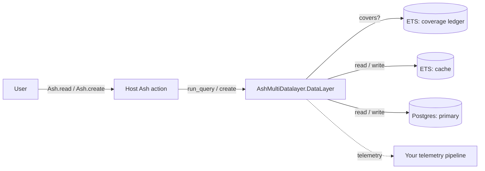

# `ash_multi_datalayer` — Runbook

**Owner**: Barnabas Jovanovics **Last verified**: 2026-07-06 (v1 implemented —
no production deployment yet) **On-call escalation**: Project maintainer /
GitHub issues

## Overview

`ash_multi_datalayer` layers an in-process ETS cache in front of AshPostgres (or
other backing datalayers) for Ash resources. On a production node, a failure can
manifest as:

- **Stale reads** (cache returns rows that no longer reflect primary).
- **Missing reads** (cache returns nothing for a row that exists in primary).
- **Memory growth** (ledger fills up or ETS cache grows unbounded).
- **Write failures** (cache-layer failure after successful primary commit;
  primary-layer failure before cache write).

Blast radius is per-resource: disabling the cache for one resource does not
affect others. There is no external service to fail over to; the underlying
datalayers (ETS, Postgres) are where real state lives.

## Architecture Quick Reference



### Key Components

| Component                      | Location                      | Health Check                                    | Logs                                           |
| ------------------------------ | ----------------------------- | ----------------------------------------------- | ---------------------------------------------- | ----------- |
| `AshMultiDatalayer.Supervisor` | Host app's supervision tree   | `Process.whereis(AshMultiDatalayer.Supervisor)` | Host app logs                                  |
| Coverage ledger                | Named ETS table per resource  | `:ets.info(table)` returns `:undefined`?        | Telemetry `[:ash_multi_datalayer, :ledger, …]` |
| Cache layer (`:l1` ETS)        | Named ETS table per resource  | Same                                            | Telemetry `[:ash_multi_datalayer, :read        | :write, …]` |
| Primary layer (`:l2` Postgres) | Your normal Postgres instance | Your existing DB health check                   | Your normal DB logs                            |
| Kill-switch state              | `:persistent_term`            | `AshMultiDatalayer.enabled?(resource)`          | Telemetry meta includes strategy               |

## Monitoring and Alerts

### Key Metrics

| Metric                                                          | Normal range    | Warning    | Critical      | Dashboard             |
| --------------------------------------------------------------- | --------------- | ---------- | ------------- | --------------------- |
| `[:ash_multi_datalayer, :read, :hit]` rate                      | ≥ 50 %          | < 30 %     | < 10 %        | Your telemetry system |
| `[:ash_multi_datalayer, :ledger, :invalidated]` count per write | ≤ 5 % of ledger | > 20 %     | > 50 %        | "                     |
| `[:ash_multi_datalayer, :ledger, :evicted]` rate                | 0               | > 10 / min | > 100 / min   | "                     |
| `[:ash_multi_datalayer, :ledger, :full]` rate                   | 0               | > 0        | any sustained | "                     |
| `[:ash_multi_datalayer, :read, :divergence_detected]` rate      | 0               | > 0        | any           | "                     |
| `[:ash_multi_datalayer, :write, :failed_at_layer]` rate         | 0               | > 0 / min  | > 1 / min     | "                     |
| ETS cache + ledger total memory (per resource)                  | —               | > 100 MB   | > 500 MB      | BEAM memory metrics   |

### Alerts

| Alert name                      | Meaning                                            | Severity | Runbook section                                       |
| ------------------------------- | -------------------------------------------------- | -------- | ----------------------------------------------------- |
| `ash_mdl.cache_hit_rate.low`    | Hit rate dropped below threshold                   | P3       | [Low cache hit rate](#symptom-low-cache-hit-rate)     |
| `ash_mdl.ledger.full`           | Ledger cap reached and eviction fired              | P2       | [Ledger full](#symptom-ledger-full-telemetry)         |
| `ash_mdl.divergence`            | Cache-vs-primary divergence detected               | P1       | [Divergence detected](#symptom-divergence-detected)   |
| `ash_mdl.write.failed_at_layer` | Cache write failed after successful primary commit | P2       | [Layer write failure](#symptom-write-failed-at-layer) |
| `ash_mdl.memory.high`           | Per-resource ETS memory over warning threshold     | P2       | [Memory growth](#symptom-high-memory-use)             |

## Common Operations

### Disable the cache for one resource (runtime kill-switch)

**When to do this**: You suspect the cache is returning wrong rows, is a memory
hog, or is making incidents worse. This is the 3-AM lever.

**Pre-checks**:

- [ ] Confirm which resource is affected (via telemetry metadata `resource`).
- [ ] Notify the team that you are disabling the cache layer for X.

**Steps**:

```elixir
# In iex attached to the affected node:
AshMultiDatalayer.disable!(MyApp.Post)
```

Or via Mix:

```bash
mix ash_multi_datalayer.disable MyApp.Post
```

**Verification**:

```elixir
AshMultiDatalayer.enabled?(MyApp.Post)    # => false
# Next read should route to the last layer in read_order only:
Ash.read!(MyApp.Post)                     # served entirely by :l2
```

While disabled: reads route to the **last** layer of `read_order`, writes route
to the **first** layer of `write_order` (both the source of truth), and ledger
invalidation still runs on writes — so re-enabling cannot serve coverage
recorded before the switch was flipped.

**Rollback**: `AshMultiDatalayer.enable!(MyApp.Post)` or
`mix ash_multi_datalayer.enable MyApp.Post`. (The shipped Mix tasks are
`ash_multi_datalayer.disable`, `ash_multi_datalayer.enable`, and
`ash_multi_datalayer.inspect`.)

### Inspect the coverage ledger

**When to do this**: Debugging cache hit/miss behaviour or verifying
invalidation.

**Steps**:

```elixir
# All entries for a resource
AshMultiDatalayer.Debug.dump_ledger(MyApp.Post)

# Tenant-scoped
AshMultiDatalayer.Debug.dump_ledger(MyApp.Post, tenant_id)

# Why does a specific query hit/miss?
AshMultiDatalayer.Debug.explain_covers?(
  MyApp.Post,
  Ash.Query.for_read(MyApp.Post, :read)
  |> Ash.Query.filter(active == true)
)
```

**Verification**: Output is a list of entries or a decision trace — no side
effects, safe to run in production.

### Flush the cache for one resource

**When to do this**: You know the cache has stale data (e.g., after a
Postgres-side manual update that bypassed Ash).

**Pre-checks**:

- [ ] Confirm the resource and tenant.
- [ ] Understand that a flush causes a brief latency spike as the cache warms
      back up.

**Steps**:

```elixir
# For specific rows (per-row purge — evicts the cached row and drops the
# coverage entries that claim it):
AshMultiDatalayer.forget!(MyApp.Post, pk_or_record, tenant: tenant_id)

# For the whole resource (NOT tenant-scoped — drops every ledger entry for
# all tenants; cached rows are then unreachable and repopulate on read):
AshMultiDatalayer.Coverage.reset(MyApp.Post)

# Or disable + re-enable (also wipes in-flight state):
AshMultiDatalayer.disable!(MyApp.Post)
AshMultiDatalayer.enable!(MyApp.Post)
```

**Verification**: `dump_ledger/2` shows no entries for that tenant; subsequent
reads fall through to primary and repopulate.

### Raise the ledger cap for one resource

**When to do this**: `[:ledger, :evicted]` fires frequently and you have
headroom to spend memory on a larger ledger.

**Steps**: This is a DSL change, not a runtime knob. Edit the resource:

```elixir
multi_data_layer do
  ledger_max_entries 30_000   # was 10_000
end
```

Then recompile and deploy.

**Verification**: `[:ledger, :evicted]` rate should drop.

### LocalOutbox: inspect and resolve sync state

The operations above are ProvenCoverage-specific. For resources whose
`orchestrator` is `AshMultiDatalayer.Orchestrator.LocalOutbox` (local-first
writes, background flush via Oban), the operational surface is:

```elixir
alias AshMultiDatalayer.Orchestrator.LocalOutbox

# What is waiting / stuck?
LocalOutbox.pending(MyApp.Todo)          # entries not yet flushed
LocalOutbox.parked(MyApp.Todo)           # conflicts / exhausted retries
LocalOutbox.status(record_or_ref)        # one record's sync state
LocalOutbox.await(record_or_ref)         # block until flushed (dev/test)

# Resolve a parked entry:
LocalOutbox.retry(entry)                 # try again (e.g. after fixing auth)
LocalOutbox.force(entry)                 # push local version, overwrite remote
LocalOutbox.discard(entry)               # drop the local write, keep remote
LocalOutbox.discard_local(entry)         # also revert the local layer's row
LocalOutbox.rebase(entry, changeset)     # resolve with a new changeset

# Pause/resume outbound flushes (e.g. during a backend incident):
LocalOutbox.pause_sync(MyApp.Todo)
LocalOutbox.resume_sync(MyApp.Todo)

# Re-pull remote state / seed an empty local layer:
LocalOutbox.refresh(MyApp.Todo, :all)
LocalOutbox.hydrate(MyApp.Todo)
```

**Resolution verbs are idempotent no-ops on an already-`:synced` entry.** Every
verb above first checks the entry's current state; calling `retry/1`, `force/1`,
`discard/1`, or `discard_local/1` on an entry that's already `:synced` (e.g. a
stale reference in an operator script, or a race where the entry flushed between
listing `parked/1` and acting on it) does nothing and returns `:ok` — it never
re-pushes an already-applied write, destroys a live chain out from under a later
write, or otherwise mutates a resolved entry. Safe to retry a resolution script
without first re-checking each entry's state.

**Park classes** (`entry.error_class`) — check this before choosing a resolution
verb:

| `error_class`          | Meaning                                                                  | Typical resolution                                                                |
| ---------------------- | ------------------------------------------------------------------------ | --------------------------------------------------------------------------------- |
| `:conflict`            | Target row moved since this client's `base_image`                        | Inspect `entry.remote_snapshot`, then `force/1`, `discard_local/1`, or `rebase/2` |
| `:rejected`            | The target permanently rejected the write (validation, etc.)             | Fix the underlying data/action, then `retry/1`, or `discard/1` to give up         |
| `:auth`                | Forbidden/credential failure — parked **immediately**, no retries burned | Fix credentials, then `retry/1` (the entry re-flushes)                            |
| `:transient_exhausted` | Transient failures (network, timeouts) exhausted their retry budget      | `retry/1` once the target is reachable again                                      |

An `:auth` park is the one class that never burns retries getting there — a
target returning `Forbidden` parks on the FIRST flush attempt, since a token
does not un-expire by retrying (masking it as `:transient_exhausted` would delay
diagnosis of what's usually a production credential/expiry issue).

Also watch the Oban `:flush` queue health — a stalled queue means writes
accumulate locally as `:pending` and nothing replicates.

### LocalOutbox: the sweeper (lost-kick recovery + pruning)

`AshMultiDatalayer.Orchestrator.LocalOutbox.Sweeper` is a periodic GenServer
(default: 60s tick, `config :ash_multi_datalayer, :outbox_sweep_interval_ms`)
started via `LocalOutbox.child_specs/1` for every configured host resource. It
does two things on every tick:

1. **Lost-kick recovery** — re-enqueues any `:pending` chain-head entry with no
   live Oban job. Rows are the source of truth for sync state; jobs are
   ephemeral pointers. A process dying between a co-committed write and its
   post-commit `Enqueue.flush` call (or `Oban.insert` itself returning
   `{:error, _}`) leaves a `:pending` row with nothing enqueued for it — the
   sweeper is the backstop that eventually notices and re-kicks it. Idempotent:
   an entry that already has a live job just gets a harmless extra one
   (`ash_oban`'s unique-job args dedupe it).
2. **`:synced` entry pruning** — destroys `:synced` outbox rows older than
   `config :ash_multi_datalayer, :outbox_synced_retention_ms` (default: 7 days).
   A `:synced` row has no further operational purpose once old enough that no
   in-flight stale-check/resolution call could still reference it; without this,
   outbox tables grow unbounded and `status/1` (which scans all of a record's
   entries) gets slower over time. Lower the retention window if disk/table size
   is a concern in a high-write-volume deployment; raise it if you rely on
   `LocalOutbox.status/1` history for auditing longer than 7 days.

**`{:global, ...}` naming is a deliberate single-node-only choice** (this
library is single-node-only in v1 — see the README's `--warnings-as-errors`
section and ADR 20260417-single-node-v1). A second node (or, locally, a second
boot attempt for the same resource set) hits an unavoidable
`{:already_started, pid}` collision on `Sweeper.start_link/1` — its supervisor
fails to boot, with a logged explanation naming the cause. This is not a bug to
work around; it is the intended failure mode for attempting multi-node
deployment against this library's current architecture.

## Troubleshooting

### Symptom: low cache hit rate

**Severity**: P3 **Likely cause**: filters include solver-unsupported
predicates, aggressive invalidation, or cold cache after restart.

**Immediate mitigation**: None required — it's a performance, not correctness
issue. The primary is absorbing the load.

**Root cause investigation**:

```elixir
AshMultiDatalayer.Debug.dump_ledger(MyApp.Post)
# Are there entries at all? Are they for different filters than the
# one you'd expect to hit?

AshMultiDatalayer.Debug.explain_covers?(MyApp.Post, some_query)
# Does it return :solver_unsupported? :no_coverage_entry?
# :fields_insufficient?
```

Check telemetry:

- `[:ash_multi_datalayer, :ledger, :invalidated]` count per write — if > 20 % of
  ledger drops per write, workload's filters are too broad.
- `[:ash_multi_datalayer, :read, :miss]` with `reason: :solver_unsupported` —
  filters use predicates outside the supported set.

**Resolution**:

- If unsupported predicates: rework resource filters to use supported shapes
  (equality, ranges, `in`, `is_nil`, conjunctions, disjunctions). Or accept
  per-resource that those reads won't hit cache.
- If aggressive invalidation: consider narrower filters; check whether writes
  are touching rows that match many ledger entries.
- If cold cache: expected after a deploy; it will warm.

### Symptom: `[:ledger, :full]` telemetry

**Severity**: P2 **Likely cause**: filter churn exceeds the cap.

**Immediate mitigation**:

```elixir
# Raise the cap for this resource (requires recompile + deploy):
# multi_data_layer do
#   ledger_max_entries 30_000
# end

# Or, if you suspect an abusive client, disable the cache temporarily:
AshMultiDatalayer.disable!(MyApp.Post)
```

**Root cause investigation**:

```elixir
AshMultiDatalayer.Debug.dump_ledger(MyApp.Post)
# Look at the filter fingerprints — are they user-supplied strings
# from URL params? Search boxes?
```

**Resolution**: validate / rate-limit / bucket user-supplied filter shapes at
the action boundary.

### Symptom: divergence detected

**Severity**: P1 — this is the "the cache is wrong" alarm.

Note: the divergence sampler defaults to `0.0` (off). This alert only exists for
resources that have opted in via `divergence_sampler` — silence from a resource
with the sampler off is not evidence of health.

**Likely cause**: solver bug (cache claimed coverage it shouldn't have) or
invalidation bug (a write should have dropped this entry).

**Immediate mitigation**:

```elixir
# Stop the bleeding:
AshMultiDatalayer.disable!(MyApp.Post)
```

Then file an issue with the telemetry metadata (`filter_fingerprint`,
`pk_delta`, `resource`).

**Root cause investigation**:

- Capture the exact filter (may require temporarily enabling `:debug_filters`
  compile flag in a non-production node).
- Reproduce locally: `Ash.read!(resource, query)` vs direct primary query;
  compare rows.

**Resolution**: upstream library fix. Until fixed, leave the cache disabled for
the affected resource or narrow `read_order` to primary-only.

### Symptom: write failed at layer

**Severity**: P2 **Likely cause**: non-first layer in `write_order` failed after
the primary commit succeeded. Data is safe in primary; cache may be stale.

**Immediate mitigation**:

```elixir
# The next read for the affected PK will fall through and backfill.
# If you need cache coherence immediately, purge the affected rows:
AshMultiDatalayer.forget!(MyApp.Post, pk_or_record, tenant: tenant_id)
# or reset the whole resource (all tenants):
AshMultiDatalayer.Coverage.reset(MyApp.Post)
```

**Root cause investigation**: the failed-layer log will include the operation +
error. Check the layer's own logs (ETS errors are rare — usually a GenServer
crash in `Coverage.TableOwner`).

**Resolution**: restart the owner GenServer if it's wedged (the supervisor
should do this automatically).

### Symptom: high memory use

**Severity**: P2 **Likely cause**: ledger or ETS cache has grown larger than the
cap suggested.

**Immediate mitigation**:

```elixir
AshMultiDatalayer.disable!(MyApp.Post)
# Then flush the ledger (all tenants):
AshMultiDatalayer.Coverage.reset(MyApp.Post)
```

**Root cause investigation**:

```elixir
:ets.info(:"Elixir.MyApp.Post.AshMultiDatalayer.Coverage")
# The earlier read layer (the cache in a cache-through config) is
# hd(AshMultiDatalayer.DataLayer.Info.read_order(MyApp.Post)); if it is
# Ash.DataLayer.Ets, inspect that layer's own table too.
```

Check `size` and `memory` (words).

**Resolution**: lower `ledger_max_entries`; investigate whether unbounded unique
filters are growing the cache too.

## Disaster Recovery

### Scenario: coverage ledger TableOwner keeps crashing

**Impact**: the resource loses cache state on every crash; each restart warms
from empty. **RTO**: seconds (supervisor restart) for state; hours to understand
the crash cause.

**Steps**:

1. Check `Logger` output for the crash reason.
2. Disable the cache for that resource until resolved.
3. If the crash is reproducible, file an issue with the stacktrace.

### Scenario: Postgres down

**Impact**: writes fail fast (first layer in `write_order`); fall-through reads
fail. The cache serves _covered_ reads successfully — so the library degrades
gracefully for read-only scenarios.

**RTO**: inherited from your Postgres recovery procedure.

**Steps**:

1. Follow your normal Postgres recovery.
2. During the outage, reads whose filters are covered keep working — don't
   disable the cache (it's the only thing still serving reads).
3. After recovery, run divergence-sampler sweeps if writes were buffered
   upstream.

### Scenario: ETS memory pressure (BEAM is OOM-killed)

**Impact**: node restart; cold cache; brief latency spike. **RTO**: your BEAM
restart time + cache warmup window.

**Steps**:

1. Disable the cache for the offending resource before restart (set
   `:persistent_term` flag via a startup hook, or deploy DSL change).
2. After the node is stable, investigate the filter-growth pattern that caused
   the memory spike (see [ledger full](#symptom-ledger-full-telemetry)).

## Maintenance Procedures

### Rolling deploy

**Frequency**: every deploy. **Maintenance window**: no (but expect a brief
latency spike as the cache warms on each new node).

**Steps**:

1. Normal rolling deploy.
2. Each new node starts with an empty cache + ledger; reads fall through until
   warm.
3. Observe `[:read, :miss]` rate during rollout — temporary spike is expected.

### Raising ledger cap per resource

**Frequency**: as needed. **Maintenance window**: DSL change → recompile →
deploy.

**Steps**:

1. Edit the resource's `multi_data_layer` block.
2. Run tests.
3. Deploy.

## Escalation

| Level | Contact                 | When to escalate                      |
| ----- | ----------------------- | ------------------------------------- |
| L1    | On-call                 | First responder; follow this runbook  |
| L2    | Library maintainer      | Suspected solver or invalidation bug  |
| L3    | Ash-project maintainers | Ash framework-level integration issue |

## Dependencies

| Dependency     | Impact if unavailable                                 | Fallback                                                    |
| -------------- | ----------------------------------------------------- | ----------------------------------------------------------- |
| Postgres       | Writes fail; covered reads still succeed              | Disable cache? No — keep the cache serving covered reads    |
| BEAM / ETS     | Cache is gone; BEAM is gone                           | N/A (library is in-process)                                 |
| `ash_postgres` | Underlying primary-layer behaviour changes on upgrade | Pin version; review upgrade notes; re-run integration tests |

## Related Documents

- [Technical deep-dive](../technical/ash-multi-datalayer.md)
- [Testing strategy](../testing/ash-multi-datalayer.md)
- [Implementation plan](../plans/ash-multi-datalayer-plan.md)
- [Guide](../guides/ash-multi-datalayer.md)

---

**Last verified**: 2026-07-06
