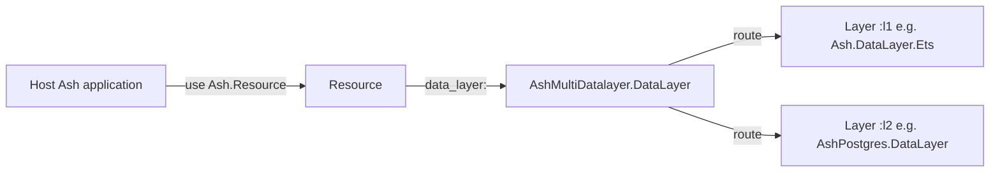
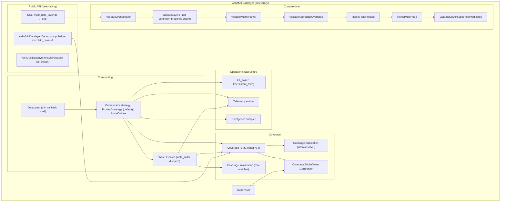
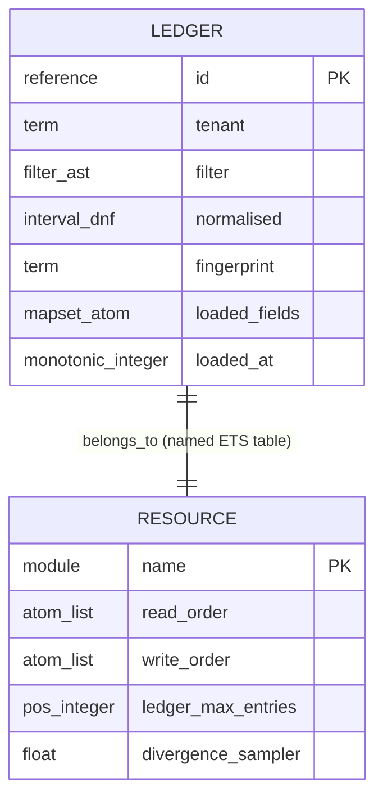
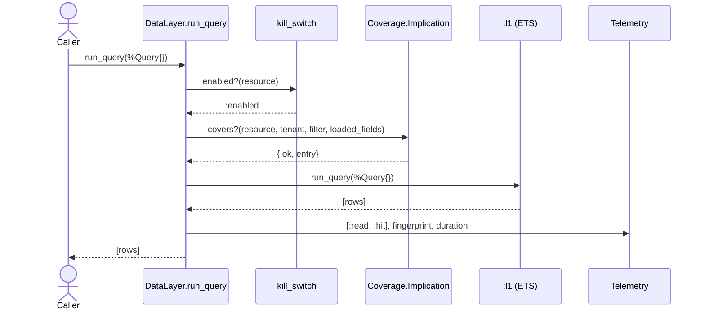
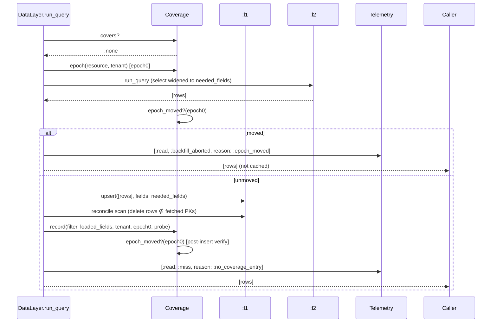
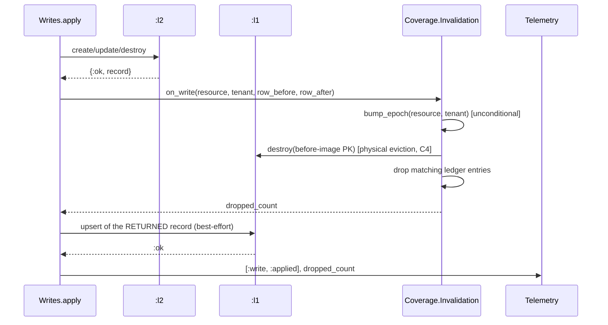

# `ash_multi_datalayer` — Technical Deep-Dive

**Last verified**: 2026-07-06 (v1 implemented; updated to match the shipped
code, including the orchestrator extraction) **Scope**: Architecture, runtime
behaviour, data model, and key decisions for v1 of the library, focused on the
default `ProvenCoverage` strategy. Does NOT cover: the `LocalOutbox`
offline-first strategy in depth (see the guide and
[20260705-local-outbox-orchestrator-rfc](../design/20260705-local-outbox-orchestrator-rfc.md)),
v2 ideas (multi-node coherence, N>2 layers). **Prerequisites**: Familiarity with
Ash 3.x resources, the `Ash.DataLayer` behaviour, and Spark DSL extensions.

## TL;DR

`ash_multi_datalayer` is an `Ash.DataLayer` implementation that wraps two (or
more) underlying datalayers in a generic ordered layering (`read_order` /
`write_order` lists). It maintains a per-resource ETS **coverage ledger** that
records which filters have been materialised into earlier layers; a
**per-attribute interval solver** decides whether an incoming query's filter is
implied by a ledger entry, and if so serves the read from the earlier layer
without fall-through. Writes are synchronous across layers; each write
**row-aware- invalidates** ledger entries whose filter matches the changed row,
preserving unrelated cached coverage. The library ships with a runtime
kill-switch, a ledger size cap + LRU eviction, a divergence sampler, and rich
telemetry.

Since the orchestrator extraction (2026-07-05), `AshMultiDatalayer.DataLayer` is
a thin callback shell: the data path is delegated to a per-resource
**orchestrator strategy** (`AshMultiDatalayer.Orchestrator` behaviour). The
default strategy, `Orchestrator.ProvenCoverage`, implements everything this
document describes; the alternative `Orchestrator.LocalOutbox` strategy
(offline-first local writes flushed through an Oban-backed outbox) is covered by
the guide and its RFC.

## Table of Contents

- [Context](#context)
- [Behavior](#behavior)
- [Architecture](#architecture)
- [Data Model](#data-model)
- [Key Decisions](#key-decisions)
- [Known Limitations](#known-limitations)
- [Implementation Notes](#implementation-notes)
- [Request/Data Flow](#requestdata-flow)
- [Configuration](#configuration)
- [Troubleshooting](#troubleshooting)

## Context



The library fits between `Ash.Resource` (as a datalayer choice) and two or more
real datalayers (which continue to own persistence). It is not a framework, not
a cache service, not a query planner — it is a delegating datalayer with a
coverage ledger bolted on.

## Behavior

### Read path (`run_query/2`)

Given `read_order = [:l1, :l2]`:

1. **Kill-switch check.** If disabled for this resource, route to `:l2` and
   return.
2. **Coverage check.** Traverse the ledger for matching tenant; use
   `Coverage.Implication.implies?/2` against each entry's normalised filter and
   the incoming filter. Return the first covering entry or `:none`.
3. **Hit path.** Matched entry → execute the query against `:l1` directly. `:l1`
   applies its own sort/limit/offset.
4. **Miss path.** No covering entry → execute against `:l2`; upsert results into
   `:l1` and record the materialised filter in the ledger. Backfilling is always
   on for multi-layer `read_order` (the `backfill?` option was removed
   2026-07-03; single-layer configs skip coverage entirely, so there was nothing
   left for it to control). Queries the coverage model cannot prove complete
   (see [Edge Cases](#edge-cases)) are served but never recorded.
5. **Divergence sample.** With probability `divergence_sampler`, even on a hit,
   re-issue the query against `:l2` and compare PK sets. Emit
   `[:ash_multi_datalayer, :read, :divergence_detected]` on mismatch.

For single-layer `read_order`, skip 2–5; go directly to the named layer.

### Write path (`create` / `update` / `destroy` / `upsert`)

Given `write_order = [:l2, :l1]`:

1. **Kill-switch check.** If disabled, write only to the **first** layer in
   `write_order` (`:l2`, the source of truth — writing the _last_ layer would
   hit only the cache and lose the write) and still run step 3.
2. **Authoritative write.** Call `:l2` first. Fail-fast on `:l2` failure — the
   operation aborts; `:l1` and the ledger are not touched.
3. **Row-aware invalidation.** For every ledger entry, evaluate its raw
   `Ash.Filter` against `row_before` and `row_after` via
   `Ash.Filter.Runtime.do_match/6` (see
   [Row-aware invalidation](#row-aware-invalidation)). Drop matching entries;
   keep the rest. This runs **before** any `:l1` write (FR3.6) so a failure in
   step 4 can never leave stale coverage behind. **Upserts** are the exception:
   there is no reliable before-image (the datalayer cannot know which existing
   row — if any — the upsert replaced), so an upsert drops the **entire tenant
   partition** of the ledger — the only provably safe option.
4. **Propagate to `:l1`.** Upsert the record `:l2` **returned** — never re-run
   the caller's changeset; `:l2`-computed fields (defaults, IDs, timestamps,
   server-side changes) exist only on the returned record (FR3.5). Failure is
   logged + telemetried but does not fail the operation: step 3 already dropped
   the covering entries, so the next matching read falls through to `:l2` — a
   cache miss, never a stale hit.

### Guarantees and Invariants

- **Correctness invariant**: any uncertainty in the solver or invalidation
  evaluator produces a cache miss or an invalidated entry, never a stale cached
  read.
- **Tenant isolation**: ledger entries are keyed by tenant; a read in tenant X
  never sees a coverage entry recorded under tenant Y. `nil`-tenant uses a
  `:__global__` sentinel so untagged entries are a distinct partition.
- **Field-policy safety**: compile-time verifier rejects any resource that
  combines `field_policies` with multi-layer `read_order` (ADR
  20260417-reject-field-policies).
- **At-most-once ledger entries per (filter, tenant)** after normalisation;
  duplicate materialisations don't produce duplicate entries.
- **Invalidation is final**: once a write invalidates coverage, no in-flight
  read may re-establish it (or cache rows under existing coverage) computed from
  pre-write state. Enforced by a per-resource+tenant invalidation epoch
  snapshotted at the top of every read that may backfill and rechecked around
  the ledger insert (see [Row-aware invalidation](#row-aware-invalidation)).
- **Covered region ⇒ the physical rows under it are fresh**: recording coverage
  for a filter never launders stale physical rows into served state — neither
  ghosts of externally-destroyed rows nor pre-update values of rows that moved
  out of the region. Upheld at the write API (`Coverage.Invalidation.on_write/4`
  evicts the physical row, not just the ledger entry) and as defense in depth on
  the read path (reconcile-on-record deletes cached rows outside the
  just-fetched set before recording).

### Edge Cases

- **Truncated or computed reads are never recorded/backfilled**: a query with
  `limit`, `offset > 0`, `distinct`, `distinct_sort`, or `lock` may return a
  result that is correct but incomplete/derived, so it can never prove complete
  coverage of its filter. It is served normally but leaves no ledger entry.
- **Limited/offset probes ARE served by recorded coverage**: a `limit`/`offset`
  query whose filter is implied by a recorded _unlimited_ entry is a hit — the
  cache layer applies sort/limit/offset itself.
- **Lock reads bypass coverage entirely** (miss reason `:not_cacheable`).
- **Calculation-loading reads use computed-value merge reads** (ADR
  20260703-computed-value-merge-reads): covered rows are served by the cache
  layer, and ONE value query (`pk in [...]`, PK + calculations only) against the
  last read layer supplies the computed values, merged by primary key. Hits
  carry `computed_values: :merged`; a cached row with no source counterpart
  abandons the merge (miss reason `:stale_cache`, full fall-through); a failing
  value query fails the read. Requires a single-attribute primary key (else
  `:not_cacheable` fall-through). Computed values are never cached. Rows fetched
  by calculation-carrying misses are backfilled/recorded normally.
- **Resource (relationship) aggregates are supported since 2026-07-04** via two
  mechanisms, both on by default: `fold_aggregates?` folds foldable kinds
  (`count`, `sum`, `avg`, `min`, `max`, `first`, `list`, `exists`) from cached
  related rows when the ledger proves them covered (0 source reads, source
  otherwise), and `sql_join_aggregates?` passes the related subquery straight
  through to SQL when source and destination share a repo (`SqlPassthrough`).
  Per-aggregate overrides exist for both. Only when **both** toggles are off
  does `can?({:aggregate, _})` answer `false`, so Ash raises
  `AggregatesNotSupported` at query build instead of returning a silently
  `NotLoaded` aggregate (SQL layers build the related subquery via the
  destination resource's _data layer_ — this library — which yields our query
  struct instead of SQL). Self-aggregation via `Ash.count/2` etc.
  (`run_aggregate_query`) works regardless.
- **Field coverage**: `Entry.loaded_fields` is `Coverage.needed_fields/2` — the
  query's select (or all attributes when unselected) **∪ the primary key ∪
  attribute refs from the filter, sort, distinct/distinct_sort, and every loaded
  calculation's expression**. Selecting a field is not the only way a query
  touches it: a filter or a locally-evaluated calc can demand a field the select
  never named, and coverage must hold it or the hit re-evaluates over rows that
  physically lack it. `covers?` requires the probe's `needed_fields` ⊆
  `loaded_fields` (otherwise miss reason `:fields_insufficient`); the remainder
  planner applies the same gate per-entry before a filter's region may
  contribute to the covered split, so a legitimately narrow entry can't poison a
  wider query's remainder read. On a fingerprint match (same normalised filter,
  re-recorded with a wider `needed_fields`), the existing entry's
  `loaded_fields` is unioned in place rather than left stale — otherwise a
  narrow-then-wide workload on the same filter would miss on
  `:fields_insufficient` forever. A narrow-select **source** read is itself
  widened to `needed_fields` before fetching (whenever it may backfill) so the
  physical rows it backfills actually contain what gets recorded; the caller's
  result is unaffected since Ash's own action pipeline narrows the final struct
  to the query's actual select.
- **Upsert writes**: no reliable before-image → the whole tenant partition of
  the ledger is dropped (see the write path above).
- **Unsupported predicate in incoming filter**: solver short-circuits to "not
  covered" → fall through to later layer (never claim a false hit).
- **Unsupported predicate in stored ledger entry** (shouldn't happen; we
  normalise at insert): treat as non-matching for subsumption.
- **Ledger at cap**: evict LRU; if eviction fails, emit `:full` and treat the
  new filter as "not covered."
- **Layer failure mid-write**: first layer failing aborts; later layer failing
  logs + telemetries but does not fail the operation.
- **Tenant = nil on a tenant-aware resource**: rejected by
  `ValidateMultitenancy` verifier at compile time, or — if a runtime caller
  bypasses tenancy — routed with `:__global__` sentinel but guarded by the
  multitenancy capability check.

## Architecture

C4 zoom level: **Container / Component**.



### Component notes

- **`DataLayer`** is both an `Ash.DataLayer` impl (`@behaviour Ash.DataLayer`;
  there is no `use Ash.DataLayer`) and a `Spark.Dsl.Extension`. Underlying
  layers' DSL extensions are **not** installed automatically — the planned
  `RegisterUnderlyingExtensions` transformer turned out to be infeasible because
  Spark resolves extensions at `use` time, before any transformer can run.
  Instead, a resource lists an underlying layer's extension explicitly
  (`use Ash.Resource, data_layer: AshMultiDatalayer.DataLayer, extensions: [AshPostgres.DataLayer]`)
  when — and only when — that layer's DSL section has required options
  (AshPostgres: yes; `Ash.DataLayer.Ets` and `AshRemote.DataLayer`: no — they
  work from defaults or bring their own extension). The `ValidateLayers`
  verifier errors with a helpful message when a required extension is missing.
- **`Coverage.TableOwner`** owns a named ETS table
  `:"#{resource}.AshMultiDatalayer.Coverage"`, started by the supervisor. Owning
  the table via a dedicated GenServer (not the calling process) avoids surprise
  orphaning on code reload or test isolation.
- **`Coverage.Implication`** normalises both filters to per-attribute interval
  DNF, then checks set containment disjunct-by-disjunct.
- **`Coverage.Invalidation`** wraps `Ash.Filter.Runtime.do_match` (arity 2..6)
  to drop ledger entries that match the changed row's before/after attribute
  values.
- **`kill_switch`** reads
  `:persistent_term.get({:ash_multi_datalayer, resource}, :enabled)` on every
  operation — nanosecond-scale.
- **Verifiers** run at resource compile time after the `multi_data_layer`
  section parses. There is no transformer.

## Data Model

The only persistent data is in the underlying layers; the ledger is in-memory
(ETS), per-resource, per-node.



- `tenant` uses a `:__global__` sentinel for `nil` so untagged entries form a
  distinct partition.
- An entry stores the filter in **both forms**: the raw `%Ash.Filter{}`
  (`filter` — re-evaluated against changed rows for runtime invalidation
  matching) **and** the normalised per-attribute interval DNF (`normalised` — so
  `implies?` is cheap at query time, with no per-read re-normalisation).
- `fingerprint` is the dedupe key: the canonicalised normalised form **including
  literal values**. It is distinct from the PII-safe _telemetry_ fingerprint,
  which type-tags values away.
- `loaded_fields` is a `MapSet` of attribute atoms — `Coverage.needed_fields/2`
  (select ∪ PK ∪ filter/sort/distinct/calculation refs, see
  [Field coverage](#edge-cases)); a ledger entry only covers an incoming query
  whose `needed_fields` are a subset of `loaded_fields`.
- The table also holds one **invalidation-epoch** object per tenant partition,
  under the 3-tuple key `{:__mdl_meta__, :epoch, tenant}` — structurally
  distinct from every entry key (a 2-tuple), so it can never collide with an
  entry or match `entries/2`'s select pattern, for any tenant value. Its value
  is `{counter, incarnation}`: `counter` increments on every invalidating write
  to that partition; `incarnation` is a fresh `System.unique_integer/1` draw
  seeded on first access (and again after a `TableOwner` restart or `reset/1`),
  so a stale pre-restart snapshot can never numerically collide with a
  post-restart one.

## Key Decisions

### Generic ordered layers (not `:cache` / `:primary`)

**Chosen**: `layer :l1, module`, `read_order`, `write_order` lists. **Why**:
caching is one use case; the library also targets tiering, migration mirroring,
polyglot persistence. Baking caching semantics into the DSL would force an API
break for non-caching users. **Rejected alternative**: `:cache` / `:primary`
named layers with `:cache_first` / `:write_through` enums. **ADR**:
[20260417-generic-ordered-layers-adr](../design/20260417-generic-ordered-layers-adr.md).

### Per-attribute interval subsumption

**Chosen**: DNF of per-attribute intervals; subsumption by set containment.
**Why**: correctness decidable by construction; no general solver needed; O(n)
per call. **Rejected alternative**: SAT-style reduction over
`Ash.Query.BooleanExpression`. **ADR**:
[20260417-interval-based-subsumption-adr](../design/20260417-interval-based-subsumption-adr.md).

### Row-aware invalidation in v1

**Chosen**: drop only ledger entries whose filter matches the changed row
(before or after), via `Ash.Filter.Runtime.do_match/6`. **Why**: "drop
everything on write" would make `:cache_first` strictly worse than a plain PK
cache under any write load. **Rejected alternative**: drop-all + row-aware as a
"fast follow-up." **ADR**:
[20260417-row-aware-invalidation-adr](../design/20260417-row-aware-invalidation-adr.md).

### `:write_behind` / Oban cut from v1

**Chosen**: synchronous writes only in v1. **Why**: unmeasured latency benefit;
at-least-once duplication risk; cross-node coherence broken. **ADR**:
[20260417-no-write-behind-in-v1-adr](../design/20260417-no-write-behind-in-v1-adr.md).

### Single-node v1

**Chosen**: compile-time verifier forces explicit ack. **ADR**:
[20260417-single-node-v1-adr](../design/20260417-single-node-v1-adr.md).

### Reject `field_policies` + fall-through

**Chosen**: compile-time verifier refuses the combination. **ADR**:
[20260417-reject-field-policies-with-fallthrough-adr](../design/20260417-reject-field-policies-with-fallthrough-adr.md).

## Known Limitations and Technical Debt

- **No multi-node coherence.** Single-node v1 by design.
- **No `:write_behind` write_order entry.** Asynchronous replication is instead
  an orchestrator concern: the `LocalOutbox` strategy commits locally and
  flushes to targets through a durable Oban-backed outbox (superseding the
  original "no async writes at all" ADR — see
  [20260705-local-outbox-orchestrator-rfc](../design/20260705-local-outbox-orchestrator-rfc.md)).
- **No `field_policies` + fall-through.** Hard-rejected at compile time.
- **No TTL beyond LRU.** `loaded_at` is recorded but not used for time-based
  eviction.
- **Aggregate/calculation support has bounds.** Relationship aggregates are
  supported (folded from cached related rows or SQL-joined on the source — since
  2026-07-04, see Edge Cases), and calculations are handled via computed-value
  merge / local evaluation; but reads with aggregates or calcs the solver/fold
  can't reason about still fall through unconditionally.
- **Per-action routing is an escape hatch, not a strategy override.**
  `read_order` / `write_order` are resource-level; `read_from:` context forces a
  read to a named layer and `write_through: true` forces a synchronous write,
  but a resource has exactly one orchestrator strategy.
- **No cache stampede prevention.** Concurrent cold-reads for the same filter
  all hit the primary; documented v2 work.
- **Only 2-layer configurations exercised in CI.** N>2 works in theory.
- **Reconcile-on-record is not a safety net for invalidation sources that never
  call `on_write/4`.** A ghost row under a surviving, still-valid entry's
  coverage is served by plain covered reads regardless of anything recording
  does — nothing local can distinguish untold staleness under valid coverage
  from freshness. `forget!/3` (or LRU eviction) is the only healer for that
  case; see [Physical eviction and reconcile-on-record]
  (#physical-eviction-and-reconcile-on-record).
- **The invalidation epoch is resource+tenant-scoped, not per-entry or
  per-row.** A write anywhere in a partition can abort an unrelated read's
  backfill under sustained concurrency (a hit-rate cost, never staleness);
  narrower epochs are the sound escape hatch if this proves painful in practice,
  not skipping the bump on zero-drop writes.

## Implementation Notes

### DSL + underlying extensions (transformer dropped)

`AshMultiDatalayer.DataLayer` uses `Spark.Dsl.Extension` with one section
(`multi_data_layer`). The planned `RegisterUnderlyingExtensions` transformer was
**not implementable**: Spark resolves a resource's extension list at `use` time,
before any transformer runs, so a transformer cannot add extensions. Implemented
replacement: resources declare underlying-layer extensions explicitly via
`extensions:` only when a layer's DSL section has required options; the
`ValidateLayers` verifier errors helpfully when one is missing. Verifiers run as
usual.

**Verified by**: `test/ash_multi_datalayer/data_layer_dsl_test.exs` (smoke),
`test/integration/generate_migrations_test.exs` (the architect's blocking
concern).

### Migration generation (`AshMultiDatalayer.Migration`)

The stock `mix ash_postgres.generate_migrations` discovers resources with a hard
equality check — `Ash.DataLayer.data_layer(resource) == AshPostgres.DataLayer`
(`migration_generator.ex:38`) — so it **silently skips** multi-datalayer
resources. `AshMultiDatalayer.Migration` works around this by building runtime
**shadow modules** for each multi-datalayer resource whose source of truth is
AshPostgres: a shadow delegates Spark introspection to the real resource,
reports `AshPostgres.DataLayer` as its data layer, and rewrites relationship
**source and destination** to shadows so foreign keys survive. Shipped as
`mix ash_multi_datalayer.generate_migrations`, plus a `codegen/1` entry point so
`mix ash.codegen` works. Integration-proven byte-identical to a plain-postgres
twin resource. An upstream `ash_postgres` PR to make resource discovery
pluggable is planned.

### Capability negotiation

`can?/2` returns `false` for `{:join, _}`, `{:lateral_join, _}`, `:combine`,
`:update_query`, `:destroy_query`, `{:atomic, _}`, and `:async_engine` —
bulk/atomic query paths would bypass the write dispatcher (and its
invalidation), so Ash falls back to per-record operations. `can?(:select)` is
decided by the **last** read layer alone: stripping select breaks layers like
`AshRemote` that derive fetched fields from it, while select-less cache layers
simply return full rows for Ash to narrow — discovered via the `ash_remote`
example. The data layer also implements `source/1` delegating to the source of
truth; without it the resource's Ecto schema source is empty and e.g.
AshPostgres INSERTs fail.

### Coverage ledger lifecycle

`AshMultiDatalayer.Supervisor` is a `Supervisor` started by the host application
in its own supervision tree. It supervises one `Coverage.TableOwner` GenServer
per resource with a multi-datalayer config. Each `TableOwner` creates a named
ETS table on init and owns it for its lifetime. On crash, the supervisor
restarts the owner; the table is lost and rebuilt (ledger entries are cache, not
source of truth).

**Verified by**: `test/ash_multi_datalayer/coverage/table_owner_test.exs`.

### Implication solver

`Coverage.Implication.normalise/1` converts an `Ash.Filter` to a list of
disjuncts; each disjunct is a `%{attribute => %Interval{}}` map. Unsupported
predicates set `:opaque` on the affected attribute; a disjunct with any
`:opaque` never subsumes anything.

`implies?/2` answers `∀ a∈A, ∃ b∈B : attrs_subset?(a, b)`. Each attribute's
interval is checked via type-specific containment (`eq ⊆ range`,
`range ⊆ range`, `in ⊆ in`, `is_nil ⊆ is_nil`, …). `attrs_subset?` iterates the
**union** of both disjuncts' attribute keys — an attribute constrained only on
the probe side must yield `false` (the original spec pseudocode iterated only
the cached side and was unsound; caught during implementation).

**Negation semantics** (implementation experience): Ash's runtime match
semantics are neither classical nor Kleene-compositional — a comparison with a
`nil` operand evaluates to `nil`, a bare `not` propagates `nil`, but `or`
collapses `nil` to `false`. Classical operator duals and De Morgan rewriting
under `Not` are therefore **unsound** here; the solver treats `Not` as opaque
except directly over `is_nil`, the only always-boolean predicate. Both bugs (the
unsound `attrs_subset?` and the unsound negation rewriting) were caught by the
10 000-case property suite cross-checking against `Ash.Filter.Runtime`.

**Verified by**: `test/ash_multi_datalayer/coverage/implication_test.exs` (unit)
and `test/ash_multi_datalayer/coverage/implication_property_test.exs`
(StreamData, 10 000 cases cross-checked against brute-force evaluation).

### Row-aware invalidation

`Coverage.Invalidation.on_write/4(resource, tenant, row_before, row_after)`
bumps the partition's invalidation epoch (unconditionally, even when nothing
below matches — see "Invalidation epoch" below), evicts the physical row from
every earlier read layer by the before-image's primary key (see "Physical
eviction" below), then iterates ledger entries, evaluates each entry's raw
`Ash.Filter` against `row_before` and `row_after`, and drops matching entries.
The evaluator is `Ash.Filter.Runtime.do_match/6` — the full signature is
`do_match(record, expr, parent \\ nil, resource \\ nil, unknown_on_unknown_refs? \\ false, conflicting_upsert_values \\ nil)`
— called with `unknown_on_unknown_refs?: true` so unresolvable refs yield
`:unknown` → conservative drop. Note Ash keeps records on **truthy** results,
not `== true`; invalidation mirrors that.

**Verified by**: `test/ash_multi_datalayer/coverage/invalidation_test.exs`
(unit), `test/ash_multi_datalayer/coverage/invalidation_property_test.exs`
(StreamData cross-check).

### Invalidation epoch

A read-miss backfill racing a concurrent write can record stale rows _and_ stale
coverage: reader fetches pre-write rows, stalls before backfilling, writer
commits (invalidation finds nothing to drop yet — the ledger has no entry for
that filter), then the reader's backfill lands the stale rows over the writer's
fresh propagation and records coverage claiming them. A per-resource+tenant
**invalidation epoch** closes this:

1. `Coverage.epoch/2` snapshots `epoch0 = {counter, incarnation}` at the top of
   every read that may backfill — before `coverage_split`/the cache-side fetch
   on the remainder path, before the source fetch everywhere else — seeding it
   lazily on first access.
2. `maybe_backfill` re-checks the epoch (`Coverage.epoch_moved?/3`) before
   upserting; a move skips backfill AND recording entirely. The fetched rows are
   still returned to the caller — the read result itself isn't stale, only
   unsafe to cache.
3. `Coverage.record/5` is **check-insert-verify**, not a pre-check alone: it
   re-checks the epoch immediately before inserting (or widening an existing
   entry on a fingerprint match), and again immediately after — a move on the
   second check drops the entry it just wrote. A pre-check alone leaves a window
   where the writer's bump-then-drop-scan lands between the reader's check and
   its ETS insert; the post-insert verify closes it (either the reader's own
   verify drops it, or the insert preceded the writer's drop-scan and the
   writer's own scan removes it).
4. `Invalidation.on_write/4` / `drop_all/2` bump the epoch **unconditionally,
   including zero-drop writes** — skipping the bump when nothing matched is
   exactly the original race (a zero-drop write racing an in-flight miss).

Cost: under sustained write concurrency, a meaningful fraction of read-miss
backfills abort recording — the correct trade (freshness over hit rate), not a
free one; `test/integration/concurrency_stress_test.exs` measures it.

**Verified by**: `test/integration/read_write_race_test.exs` (deterministic, via
a blocking wrapper layer that parks `run_query` _after_ delegating — never
sleeps), `test/integration/concurrency_stress_test.exs`.

### Physical eviction and reconcile-on-record

Dropping a ledger entry only removes the _metadata claim_ that a filter is
covered — the physical row can still sit in an earlier layer's storage, and a
later, differently-shaped read can legitimately record coverage over a region
that still contains it, resurrecting a destroyed or pre-update row as if it were
live. Two mechanisms uphold "covered region ⇒ physical rows are fresh":

- **Evict-on-write** (`Invalidation.on_write/4`, closes the class at the API):
  after bumping the epoch, evicts the row from every earlier read layer by the
  **before-image's** primary key — for both destroys and updates (an update's
  before-PK row is the stale one even when the update changed the PK itself; the
  after-PK row heals via ordinary upsert/refetch). Runs regardless of the kill
  switch (it's part of invalidation, not propagation). Eviction failure is
  swallowed (logged + telemetried;
  `[:ash_multi_datalayer, :ledger, :evict_failed]`) — never fails the write.

  Between this eviction and `WriteDispatch.propagate/5`'s re-upsert of the fresh
  record, a reader can observe the row **physically absent** from an earlier
  layer, even though it existed before the update and exists again immediately
  after — an absence **anomaly** (a state that never logically existed), not
  staleness (a state that WAS true once). The epoch/ledger protocol above guards
  against serving a stale value; it does not close this narrower, self-healing
  window. Accepted by decision (M-7, doc-only): revisit upsert-in-place for
  updates (evict only on destroy/PK-change) only if this shows up in practice.

- **Reconcile-on-record** (defense in depth, inside `maybe_backfill`, between
  the physical backfill and `Coverage.record`'s insert): deletes cached rows
  matching the just-recorded region whose primary key is **not** in the
  source-fetched set — scoped to the whole of Q on the full-miss path, to
  `Q ∧ ¬C` (threaded from the remainder planner, never recomputed) on the
  remainder path, since the covered half's rows are legitimately absent from a
  `¬C`-only fetch. This is what heals the residue of a failed eviction, and any
  stale row under a region being freshly re-recorded — it is **not** a safety
  net for an invalidation source that never calls `on_write/4` at all (a ghost
  under a _surviving_, still-valid entry's coverage is served by plain covered
  reads regardless of anything recording does).

  The eviction itself joins the epoch protocol (M-3): a reader's reconcile pass
  can find a "ghost" (cached, absent from this reader's own — possibly stale —
  fetch) that another, faster reader legitimately fetched and recorded coverage
  over moments earlier. Evicting it via a bare destroy, with no epoch/ledger
  awareness, would leave that other reader's coverage entry pointing at a
  now-missing row — a lasting, silent missing-row cache hit.
  `Invalidation.on_evict/3` closes this the same way `on_write/4` closes the
  write-side race: one batched call per reconcile pass bumps the epoch and drops
  every ledger entry covering any evicted ghost (`should_drop?` as a
  destroy-style check, `row_after: nil`), so a reader racing the eviction sees
  the bumped epoch and aborts its own `Coverage.record/5` — including,
  intentionally, the reconcile-initiating reader's own record call. The next
  identical read is then a clean miss that refetches and records fresh coverage.

For consumers that discover staleness out-of-band (a lost realtime notification,
typically surfaced as a `NotFound` from a direct call),
`AshMultiDatalayer.forget!/3` promotes the same evict-on-write mechanism as a
public pull-based healer: `forget!(resource, pk_or_record, opts)` is
`Invalidation.on_write(resource, tenant, record, nil)` in a wrapper. A PK-only
call builds the probe with every non-PK attribute set to `%Ash.NotLoaded{}`,
never `nil` — under Ash's nil semantics a nil-built probe would let an entry
that actually covers the row's true state survive the drop (`age > 5` over
`age: nil` is a non-match), evicting the physical row while its stale coverage
lives on. `AshMultiDatalayer.not_found?/1` is the matching predicate over
`Ash.Error.Query.NotFound`, including wrapped/list error shapes.

**Verified by**: `test/integration/external_invalidation_test.exs` (the C4 ghost
shapes — same-filter, unrelated-remainder, update-moves-region),
`test/integration/reconcile_scope_test.exs` (the documented scope boundary),
`test/integration/forget_test.exs`,
`test/integration/reconcile_epoch_race_test.exs` (M-3: the reconcile-eviction
race, deterministic via a blocking transport that parks the cache-layer scan
_before_ delegating — the inverse of the read/write race harness's ordering,
needed so the parked call observes state written during the pause).

### Kill-switch

`AshMultiDatalayer.disable!/1` writes
`:persistent_term.put({:ash_multi_datalayer, resource}, :disabled)`. The runtime
check reads with a default of `:enabled`. Reads are lock-free and essentially
free.

## Request/Data Flow

### Coverage-hit read



### Coverage-miss read + backfill



### Write with row-aware invalidation



## Configuration

| Option                              | Description                                                  | Default         | Location                          |
| ----------------------------------- | ------------------------------------------------------------ | --------------- | --------------------------------- |
| `layer :name, module`               | Declare an underlying layer                                  | —               | Resource `multi_data_layer` block |
| `read_order :: [atom]`              | Layers consulted for reads, in order                         | —               | Resource `multi_data_layer` block |
| `write_order :: [atom]`             | Layers written to, in order                                  | —               | Resource `multi_data_layer` block |
| `ledger_max_entries :: pos_integer` | Cap on ledger entries per resource+tenant                    | `10_000`        | Resource `multi_data_layer` block |
| `divergence_sampler :: float`       | Fraction of hit reads that shadow-re-run against later layer | `0.0` (opt-in)  | Resource `multi_data_layer` block |
| `:assume_single_node`               | App-wide ack that deployment is single-node                  | `false` (warns) | `config :ash_multi_datalayer, …`  |
| `:debug_filters`                    | Include raw filter values in telemetry                       | `false`         | `config :ash_multi_datalayer, …`  |

## Troubleshooting

### Symptom: `can?(:transact)` returns `false` on a Postgres-only resource

**Cause**: The cache layer is in `write_order`; ETS is non-transactional.

**Fix**:

- Check `AshMultiDatalayer.DataLayer.Info.write_order(resource)`. If ETS is in
  it, `:transact` is correctly `false`.
- For a primary-only write config, set `write_order [:l2]` (only the
  transactional layer).

### Symptom: `ash_multi_datalayer v1 is single-node-only` warning at compile

**Cause**: `RejectMultiNode` verifier; no ack config set.

**Fix**: Add `config :ash_multi_datalayer, :assume_single_node, true` to
`config/config.exs`. If your deployment is multi-node, do NOT set this — see the
single-node ADR.

### Symptom: cache hit rate is 0 % even on repeated reads

**Cause**: Likely row-aware invalidation is dropping ledger entries on every
write, or the solver is short-circuiting to `false`.

**Fix**:

```bash
# From iex -S mix:
AshMultiDatalayer.Debug.dump_ledger(MyApp.Post)
AshMultiDatalayer.Debug.explain_covers?(MyApp.Post, Ash.Query.for_read(MyApp.Post, :read))
```

Look at the solver trace; if every entry says `:solver_unsupported`, filters
include predicates the solver can't reason about. Simplify or accept the cache
miss.

### Symptom: `[:ash_multi_datalayer, :ledger, :full]` telemetry firing

**Cause**: Filter churn is filling the ledger faster than eviction.

**Fix**:

- Raise `ledger_max_entries` for that resource.
- Investigate upstream: is a client generating unique filters from unbounded
  user input?
- Rate-limit or validate filters at the action layer.

## Related Documents

- [PRD](../design/ash-multi-datalayer-prd.md)
- [RFC](../design/ash-multi-datalayer-rfc.md)
- [Plan](../plans/ash-multi-datalayer-plan.md)
- [Runbook](../runbooks/ash-multi-datalayer.md)
- [Guide](../guides/ash-multi-datalayer.md)
- [Testing strategy](../testing/ash-multi-datalayer.md)

---

**Last verified**: 2026-07-03
