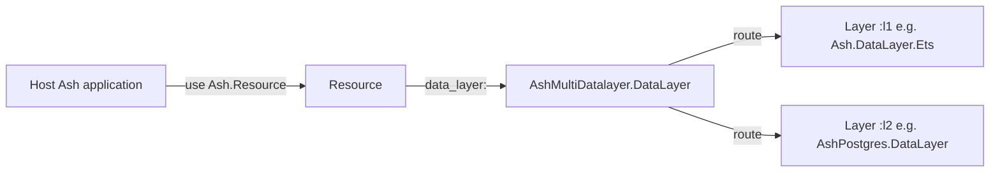
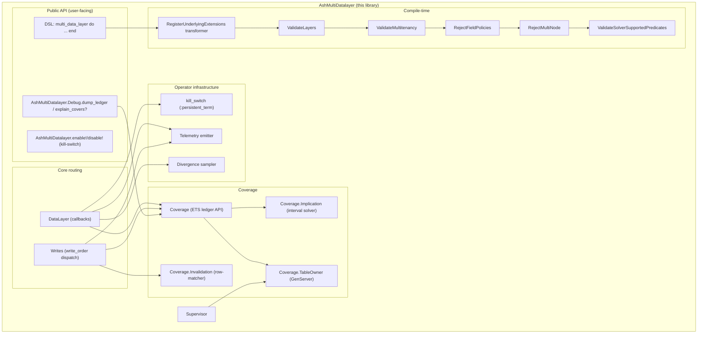
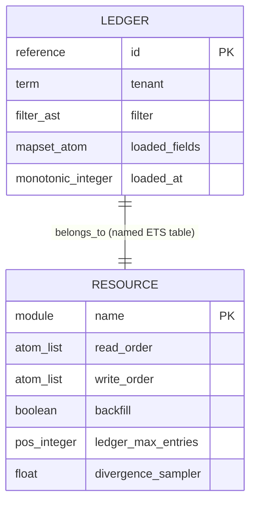
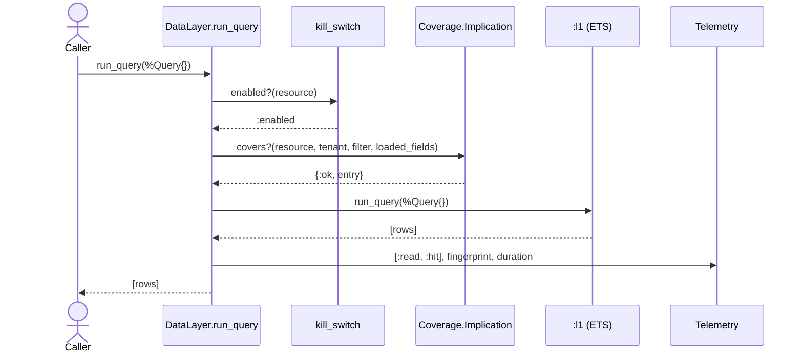
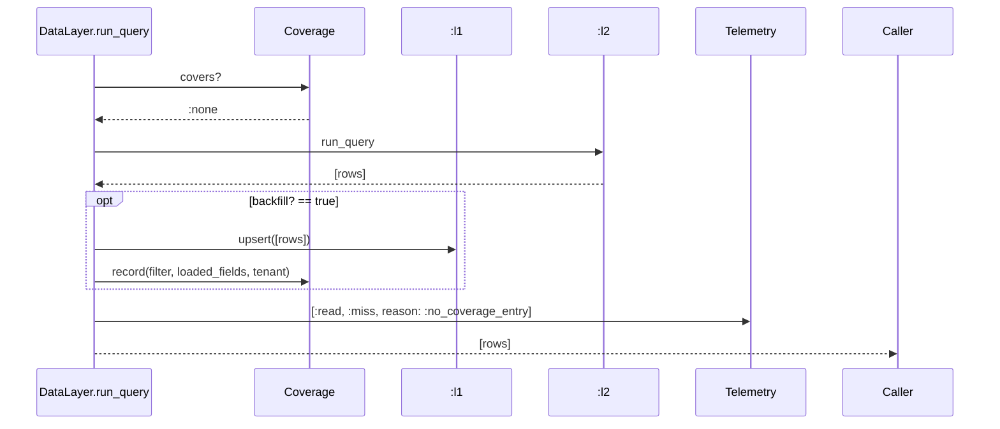
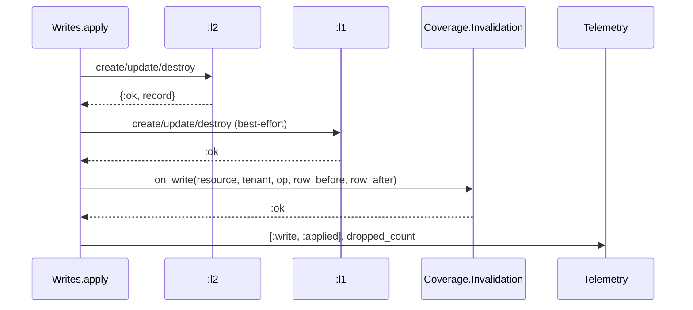

# `ash_multi_datalayer` — Technical Deep-Dive

**Last verified**: 2026-04-17 (plan-stage; no code yet) **Scope**: Architecture,
runtime behaviour, data model, and key decisions for v1 of the library. Does NOT
cover: v2 ideas (`:write_behind`, multi-node coherence, N>2 layers).
**Prerequisites**: Familiarity with Ash 3.x resources, the `Ash.DataLayer`
behaviour, and Spark DSL extensions.

## TL;DR

`ash_multi_datalayer` is an `Ash.DataLayer` implementation that wraps two (or
more) underlying datalayers in a generic ordered layering (`read_order` /
`write_order` lists). It maintains a per-resource ETS **coverage ledger** that
records which filters have been materialised into earlier layers; a
**per-attribute interval solver** decides whether an incoming query's filter is
implied by a ledger entry, and if so serves the read from the earlier layer
without fall-through. Writes are synchronous across layers; each write
**row-aware- invalidates** ledger entries whose filter matches the changed row,
preserving unrelated cached coverage. The library ships with a runtime
kill-switch, a ledger size cap + LRU eviction, a divergence sampler, and rich
telemetry.

## Table of Contents

- [Context](#context)
- [Behavior](#behavior)
- [Architecture](#architecture)
- [Data Model](#data-model)
- [Key Decisions](#key-decisions)
- [Known Limitations](#known-limitations)
- [Implementation Notes](#implementation-notes)
- [Request/Data Flow](#requestdata-flow)
- [Configuration](#configuration)
- [Troubleshooting](#troubleshooting)

## Context



The library fits between `Ash.Resource` (as a datalayer choice) and two or more
real datalayers (which continue to own persistence). It is not a framework, not
a cache service, not a query planner — it is a delegating datalayer with a
coverage ledger bolted on.

## Behavior

### Read path (`run_query/2`)

Given `read_order = [:l1, :l2]`:

1. **Kill-switch check.** If disabled for this resource, route to `:l2` and
   return.
2. **Coverage check.** Traverse the ledger for matching tenant; use
   `Coverage.Implication.implies?/2` against each entry's normalised filter and
   the incoming filter. Return the first covering entry or `:none`.
3. **Hit path.** Matched entry → execute the query against `:l1` directly. `:l1`
   applies its own sort/limit/offset.
4. **Miss path.** No covering entry → execute against `:l2`; if `backfill?` is
   true, upsert results into `:l1` and record the materialised filter in the
   ledger.
5. **Divergence sample.** With probability `divergence_sampler`, even on a hit,
   re-issue the query against `:l2` and compare PK sets. Emit
   `[:ash_multi_datalayer, :read, :divergence_detected]` on mismatch.

For single-layer `read_order`, skip 2–5; go directly to the named layer.

### Write path (`create` / `update` / `destroy` / `upsert`)

Given `write_order = [:l2, :l1]`:

1. **Kill-switch check.** If disabled, write only to the **first** layer in
   `write_order` (`:l2`, the source of truth — writing the *last* layer would
   hit only the cache and lose the write) and still run step 3.
2. **Authoritative write.** Call `:l2` first. Fail-fast on `:l2` failure — the
   operation aborts; `:l1` and the ledger are not touched.
3. **Row-aware invalidation.** For every ledger entry, evaluate its filter
   against `row_before` and `row_after` via `Ash.Filter.Runtime.do_match/2`.
   Drop matching entries; keep the rest. This runs **before** any `:l1` write
   (FR3.6) so a failure in step 4 can never leave stale coverage behind.
4. **Propagate to `:l1`.** Upsert the record `:l2` **returned** — never re-run
   the caller's changeset; `:l2`-computed fields (defaults, IDs, timestamps,
   server-side changes) exist only on the returned record (FR3.5). Failure is
   logged + telemetried but does not fail the operation: step 3 already dropped
   the covering entries, so the next matching read falls through to `:l2` — a
   cache miss, never a stale hit.

### Guarantees and Invariants

- **Correctness invariant**: any uncertainty in the solver or invalidation
  evaluator produces a cache miss or an invalidated entry, never a stale cached
  read.
- **Tenant isolation**: ledger entries are keyed by tenant; a read in tenant X
  never sees a coverage entry recorded under tenant Y. `nil`-tenant uses a
  `:__global__` sentinel so untagged entries are a distinct partition.
- **Field-policy safety**: compile-time verifier rejects any resource that
  combines `field_policies` with multi-layer `read_order` (ADR
  20260417-reject-field-policies).
- **At-most-once ledger entries per (filter, tenant)** after normalisation;
  duplicate materialisations don't produce duplicate entries.

### Edge Cases

- **Unsupported predicate in incoming filter**: solver short-circuits to "not
  covered" → fall through to later layer (never claim a false hit).
- **Unsupported predicate in stored ledger entry** (shouldn't happen; we
  normalise at insert): treat as non-matching for subsumption.
- **Ledger at cap**: evict LRU; if eviction fails, emit `:full` and treat the
  new filter as "not covered."
- **Layer failure mid-write**: first layer failing aborts; later layer failing
  logs + telemetries but does not fail the operation.
- **Tenant = nil on a tenant-aware resource**: rejected by
  `ValidateMultitenancy` verifier at compile time, or — if a runtime caller
  bypasses tenancy — routed with `:__global__` sentinel but guarded by the
  multitenancy capability check.

## Architecture

C4 zoom level: **Container / Component**.



### Component notes

- **`DataLayer`** is both an `Ash.DataLayer` impl and a `Spark.Dsl.Extension`.
  The `extensions/1` callback returns the underlying layers' DSL extensions,
  brought in by `Tr`.
- **`Coverage.TableOwner`** owns a named ETS table
  `:"#{resource}.AshMultiDatalayer.Coverage"`, started by the supervisor. Owning
  the table via a dedicated GenServer (not the calling process) avoids surprise
  orphaning on code reload or test isolation.
- **`Coverage.Implication`** normalises both filters to per-attribute interval
  DNF, then checks set containment disjunct-by-disjunct.
- **`Coverage.Invalidation`** wraps `Ash.Filter.Runtime.do_match/2` to drop
  ledger entries that match the changed row's before/after attribute values.
- **`kill_switch`** reads
  `:persistent_term.get({:ash_multi_datalayer, resource}, :enabled)` on every
  operation — nanosecond-scale.
- **Verifiers** run at resource compile time; transformer runs after the
  `multi_data_layer` section parses and before verifiers.

## Data Model

The only persistent data is in the underlying layers; the ledger is in-memory
(ETS), per-resource, per-node.



- `tenant` uses a `:__global__` sentinel for `nil` so untagged entries form a
  distinct partition.
- `filter` is stored normalised (interval DNF) so `implies?` is cheap at query
  time.
- `loaded_fields` is a `MapSet` of attribute atoms; a ledger entry only covers
  an incoming query whose selected fields are a subset.

## Key Decisions

### Generic ordered layers (not `:cache` / `:primary`)

**Chosen**: `layer :l1, module`, `read_order`, `write_order` lists. **Why**:
caching is one use case; the library also targets tiering, migration mirroring,
polyglot persistence. Baking caching semantics into the DSL would force an API
break for non-caching users. **Rejected alternative**: `:cache` / `:primary`
named layers with `:cache_first` / `:write_through` enums. **ADR**:
[20260417-generic-ordered-layers-adr](../design/20260417-generic-ordered-layers-adr.md).

### Per-attribute interval subsumption

**Chosen**: DNF of per-attribute intervals; subsumption by set containment.
**Why**: correctness decidable by construction; no general solver needed; O(n)
per call. **Rejected alternative**: SAT-style reduction over
`Ash.Query.BooleanExpression`. **ADR**:
[20260417-interval-based-subsumption-adr](../design/20260417-interval-based-subsumption-adr.md).

### Row-aware invalidation in v1

**Chosen**: drop only ledger entries whose filter matches the changed row
(before or after), via `Ash.Filter.Runtime.do_match/2`. **Why**: "drop
everything on write" would make `:cache_first` strictly worse than a plain PK
cache under any write load. **Rejected alternative**: drop-all + row-aware as a
"fast follow-up." **ADR**:
[20260417-row-aware-invalidation-adr](../design/20260417-row-aware-invalidation-adr.md).

### `:write_behind` / Oban cut from v1

**Chosen**: synchronous writes only in v1. **Why**: unmeasured latency benefit;
at-least-once duplication risk; cross-node coherence broken. **ADR**:
[20260417-no-write-behind-in-v1-adr](../design/20260417-no-write-behind-in-v1-adr.md).

### Single-node v1

**Chosen**: compile-time verifier forces explicit ack. **ADR**:
[20260417-single-node-v1-adr](../design/20260417-single-node-v1-adr.md).

### Reject `field_policies` + fall-through

**Chosen**: compile-time verifier refuses the combination. **ADR**:
[20260417-reject-field-policies-with-fallthrough-adr](../design/20260417-reject-field-policies-with-fallthrough-adr.md).

## Known Limitations and Technical Debt

- **No multi-node coherence.** Single-node v1 by design.
- **No `:write_behind`.** Users wire asynchronous primary writes in their
  actions if they need them.
- **No `field_policies` + fall-through.** Hard-rejected at compile time.
- **No TTL beyond LRU.** `loaded_at` is recorded but not used for time-based
  eviction.
- **No aggregate/calculation subsumption.** Reads that include aggregates the
  solver can't reason about fall through unconditionally.
- **No per-action strategy override.** `read_order` / `write_order` are
  resource-level.
- **No cache stampede prevention.** Concurrent cold-reads for the same filter
  all hit the primary; documented v2 work.
- **Only 2-layer configurations exercised in CI.** N>2 works in theory.

## Implementation Notes

### DSL + transformer

`AshMultiDatalayer.DataLayer` uses `Spark.Dsl.Extension` with one section
(`multi_data_layer`) and one transformer (`RegisterUnderlyingExtensions`). The
transformer's `Spark.Dsl.Transformer.transform/1` callback reads parsed `layer`
entities, calls `Spark.Dsl.Extension.add_extensions/2` with each underlying
layer's extension module. Verifiers run after.

**Verified by**: `test/ash_multi_datalayer/data_layer_test.exs` (smoke),
`test/integration/generate_migrations_test.exs` (the architect's blocking
concern).

### Coverage ledger lifecycle

`AshMultiDatalayer.Supervisor` is a `Supervisor` started by the host application
in its own supervision tree. It supervises one `Coverage.TableOwner` GenServer
per resource with a multi-datalayer config. Each `TableOwner` creates a named
ETS table on init and owns it for its lifetime. On crash, the supervisor
restarts the owner; the table is lost and rebuilt (ledger entries are cache, not
source of truth).

**Verified by**: `test/ash_multi_datalayer/coverage/table_owner_test.exs`.

### Implication solver

`Coverage.Implication.normalise/1` converts an `Ash.Filter` to a list of
disjuncts; each disjunct is a `%{attribute => %Interval{}}` map. Unsupported
predicates set `:opaque` on the affected attribute; a disjunct with any
`:opaque` never subsumes anything.

`implies?/2` answers `∀ a∈A, ∃ b∈B : attrs_subset?(a, b)`. Each attribute's
interval is checked via type-specific containment (`eq ⊆ range`,
`range ⊆ range`, `in ⊆ in`, `is_nil ⊆ is_nil`, …).

**Verified by**: `test/ash_multi_datalayer/coverage/implication_test.exs` (unit)
and `test/ash_multi_datalayer/coverage/implication_property_test.exs`
(StreamData, 10 000 cases cross-checked against brute-force evaluation).

### Row-aware invalidation

`Coverage.Invalidation.on_write/5(resource, tenant, op, row_before, row_after)`
iterates ledger entries, evaluates each filter via
`Ash.Filter.Runtime.do_match/2` against `row_before` and `row_after`, and drops
matching entries. `:unknown` from the evaluator drops conservatively.

**Verified by**: `test/ash_multi_datalayer/coverage/invalidation_test.exs`
(unit), `test/ash_multi_datalayer/coverage/invalidation_property_test.exs`
(StreamData cross-check).

### Kill-switch

`AshMultiDatalayer.disable!/1` writes
`:persistent_term.put({:ash_multi_datalayer, resource}, :disabled)`. The runtime
check reads with a default of `:enabled`. Reads are lock-free and essentially
free.

## Request/Data Flow

### Coverage-hit read



### Coverage-miss read + backfill



### Write with row-aware invalidation



## Configuration

| Option                              | Description                                                  | Default         | Location                          |
| ----------------------------------- | ------------------------------------------------------------ | --------------- | --------------------------------- |
| `layer :name, module`               | Declare an underlying layer                                  | —               | Resource `multi_data_layer` block |
| `read_order :: [atom]`              | Layers consulted for reads, in order                         | —               | Resource `multi_data_layer` block |
| `write_order :: [atom]`             | Layers written to, in order                                  | —               | Resource `multi_data_layer` block |
| `backfill? :: boolean`              | Populate earlier layers from later-layer reads               | `true`          | Resource `multi_data_layer` block |
| `ledger_max_entries :: pos_integer` | Cap on ledger entries per resource+tenant                    | `10_000`        | Resource `multi_data_layer` block |
| `divergence_sampler :: float`       | Fraction of hit reads that shadow-re-run against later layer | `0.01`          | Resource `multi_data_layer` block |
| `:assume_single_node`               | App-wide ack that deployment is single-node                  | `false` (warns) | `config :ash_multi_datalayer, …`  |
| `:debug_filters`                    | Include raw filter values in telemetry                       | `false`         | `config :ash_multi_datalayer, …`  |

## Troubleshooting

### Symptom: `can?(:transact)` returns `false` on a Postgres-only resource

**Cause**: The cache layer is in `write_order`; ETS is non-transactional.

**Fix**:

- Check `AshMultiDatalayer.DataLayer.Info.write_order(resource)`. If ETS is in
  it, `:transact` is correctly `false`.
- For a primary-only write config, set `write_order [:l2]` (only the
  transactional layer).

### Symptom: `ash_multi_datalayer v1 is single-node-only` warning at compile

**Cause**: `RejectMultiNode` verifier; no ack config set.

**Fix**: Add `config :ash_multi_datalayer, :assume_single_node, true` to
`config/config.exs`. If your deployment is multi-node, do NOT set this — see the
single-node ADR.

### Symptom: cache hit rate is 0 % even on repeated reads

**Cause**: Likely row-aware invalidation is dropping ledger entries on every
write, or the solver is short-circuiting to `false`.

**Fix**:

```bash
# From iex -S mix:
AshMultiDatalayer.Debug.dump_ledger(MyApp.Post)
AshMultiDatalayer.Debug.explain_covers?(MyApp.Post, Ash.Query.for_read(MyApp.Post, :read))
```

Look at the solver trace; if every entry says `:solver_unsupported`, filters
include predicates the solver can't reason about. Simplify or accept the cache
miss.

### Symptom: `[:ash_multi_datalayer, :ledger, :full]` telemetry firing

**Cause**: Filter churn is filling the ledger faster than eviction.

**Fix**:

- Raise `ledger_max_entries` for that resource.
- Investigate upstream: is a client generating unique filters from unbounded
  user input?
- Rate-limit or validate filters at the action layer.

## Related Documents

- [PRD](../design/ash-multi-datalayer-prd.md)
- [RFC](../design/ash-multi-datalayer-rfc.md)
- [Plan](../plans/ash-multi-datalayer-plan.md)
- [Runbook](../runbooks/ash-multi-datalayer.md)
- [Guide](../guides/ash-multi-datalayer.md)
- [Testing strategy](../testing/ash-multi-datalayer.md)

---

**Last verified**: 2026-04-17
